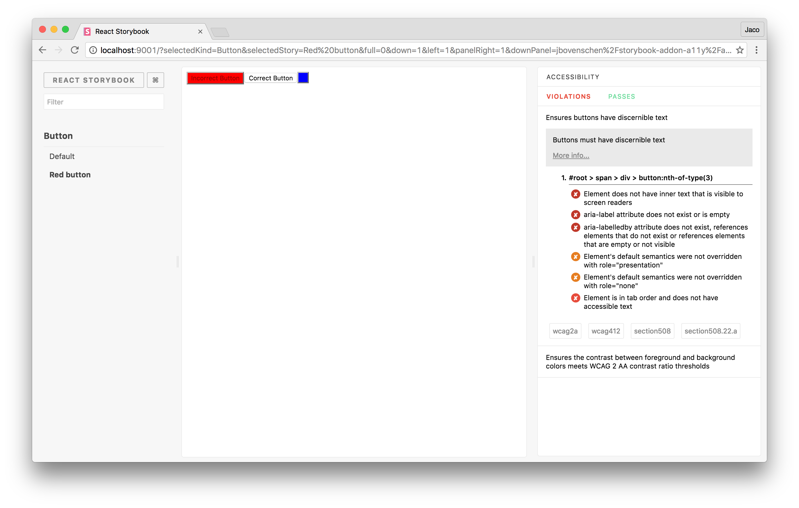

# storybook-addon-a11y

This storybook addon can be helpful to make your UI components more accessible.

[Framework Support](https://github.com/storybooks/storybook/blob/master/ADDONS_SUPPORT.md)



## Getting started

First, install the addon.

```sh
$ npm install -D @storybook/addon-a11y
```

Add this line to your `addons.js` file (create this file inside your storybook config directory if needed).

```js
import '@storybook/addon-a11y/register';
```

import the `'checkA11y'` decorator to check your stories for violations within your components.

```js
import React from 'react';
import { storiesOf } from '@storybook/react';

import { checkA11y } from '@storybook/addon-a11y';

storiesOf('button', module)
  .addDecorator(checkA11y)
  .add('Accessible', () => (
    <button>
      Accessible button
    </button>
  ))
  .add('Inaccessible', () => (
    <button style={{ backgroundColor: 'red', color: 'darkRed', }}>
      Inaccessible button
    </button>
  ));
```

For more customizability. Use the `'configureA11y'` function to configure [aXe options](https://github.com/dequelabs/axe-core/blob/develop/doc/API.md#api-name-axeconfigure).

```js
import React from 'react';
import { storiesOf } from '@storybook/react';

import { checkA11y, configureA11y } from '@storybook/addon-a11y';

const whateverOptionsYouWant = {};
configureA11y(whateverOptionsYouWant);

storiesOf('button', module)
  .addDecorator(checkA11y)
  .add('Accessible', () => (
    <button>
      Accessible button
    </button>
  ))
  .add('Inaccessible', () => (
    <button style={{ backgroundColor: 'red', color: 'darkRed', }}>
      Inaccessible button
    </button>
  ));
```

If you want to add a11y globally to your stories, you can use the global Storybook decorator in your *.storybook/config.js* file:

```js
import { configure, addDecorator } from '@storybook/react';
import { checkA11y } from '@storybook/addon-a11y';

// pick all stories.js files within the src/ folder
const req = require.context('../src', true, /stories\.js$/);

addDecorator(checkA11y);

function loadStories() {
  req.keys().forEach(filename => req(filename));
}

configure(loadStories, module);
```

## Roadmap

* Make UI accessibile
* Add color blindness filters ([Example](http://lowvision.support/))
* Show in story where violations are.
* Make it configurable
* Add more example tests
* Add tests
* Make CI integration possible
