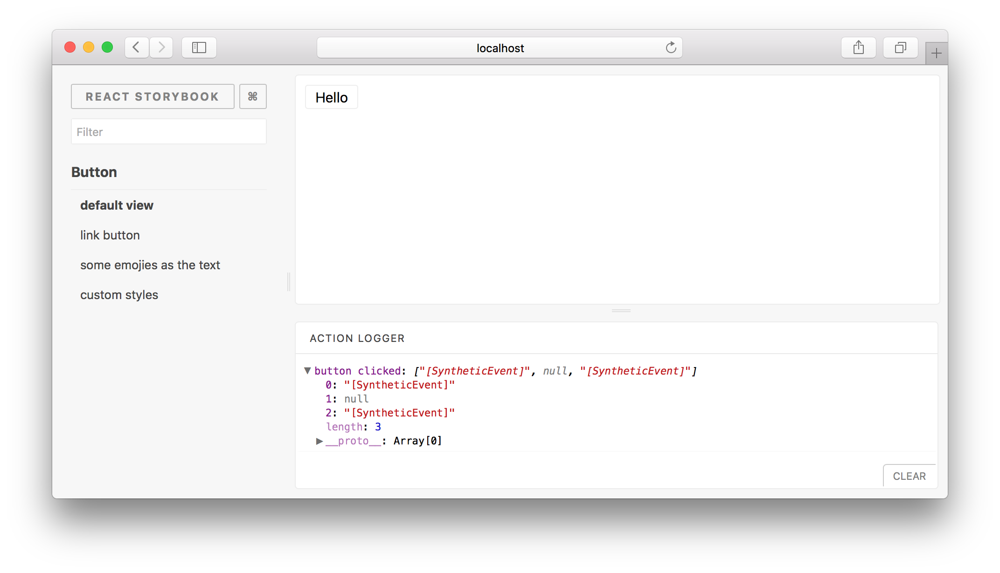

# Storybook Addon Actions

[](https://circleci.com/gh/storybooks/storybook)
[](https://www.codefactor.io/repository/github/storybooks/storybook)
[](https://snyk.io/test/github/storybooks/storybook/8f36abfd6697e58cd76df3526b52e4b9dc894847)
[](https://bettercodehub.com/results/storybooks/storybook) [](https://codecov.io/gh/storybooks/storybook)
[](https://now-examples-slackin-rrirkqohko.now.sh/)
[](#backers) [](#sponsors)

* * *

Storybook Addon Actions can be used to display data received by event handlers in [Storybook](https://storybook.js.org).

This addon works with Storybook for:
- [React](https://github.com/storybooks/storybook/tree/master/app/react)
- [React Native](https://github.com/storybooks/storybook/tree/master/app/react-native)
- [Vue](https://github.com/storybooks/storybook/tree/master/app/vue).



## Getting Started

Install:

```sh
npm i -D @storybook/addon-actions
```

Then, add following content to `.storybook/addons.js`

```js
import '@storybook/addon-actions/register';
```

Import the `action` function and use it to create actions handlers. When creating action handlers, provide a **name** to make it easier to identify.

> _Note: Make sure NOT to use reserved words as function names. [issues#29](https://github.com/storybooks/storybook-addon-actions/issues/29#issuecomment-288274794)_

```js
import { storiesOf } from '@storybook/react';
import { action } from '@storybook/addon-actions';

import Button from './button';

storiesOf('Button', module)
  .add('default view', () => (
    <Button onClick={ action('button-click') }>
      Hello World!
    </Button>
  ))
```

## Action Decorators

If you wish to process action data before sending them over to the logger, you can do it with action decorators.

`decorateAction` takes an array of decorator functions. Each decorator function is passed an array of arguments, and should return a new arguments array to use. `decorateAction` returns a function that can be used like `action` but will log the modified arguments instead of the original arguments.

```js
import { decorateAction } from '@storybook/addon-actions';

import Button from './button';

const firstArgAction = decorateAction([
  args => args.slice(0, 1)
]);

storiesOf('Button', module)
  .add('default view', () => (
    <Button onClick={ firstArgAction('button-click') }>
      Hello World!
    </Button>
  ))
```
