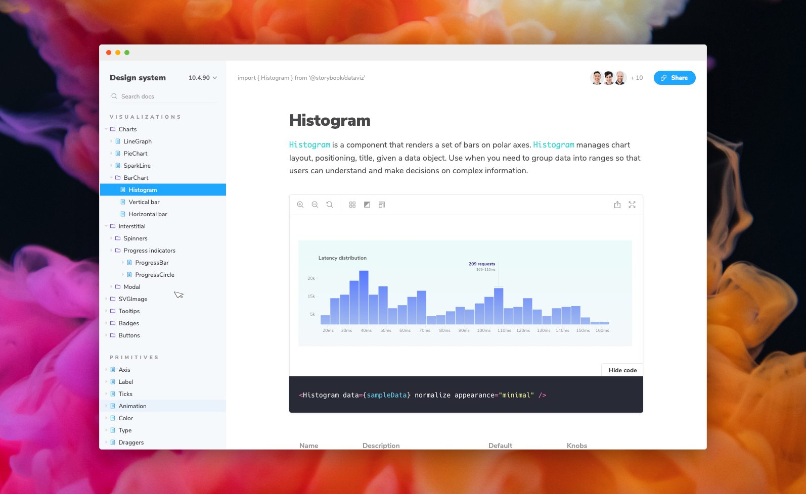
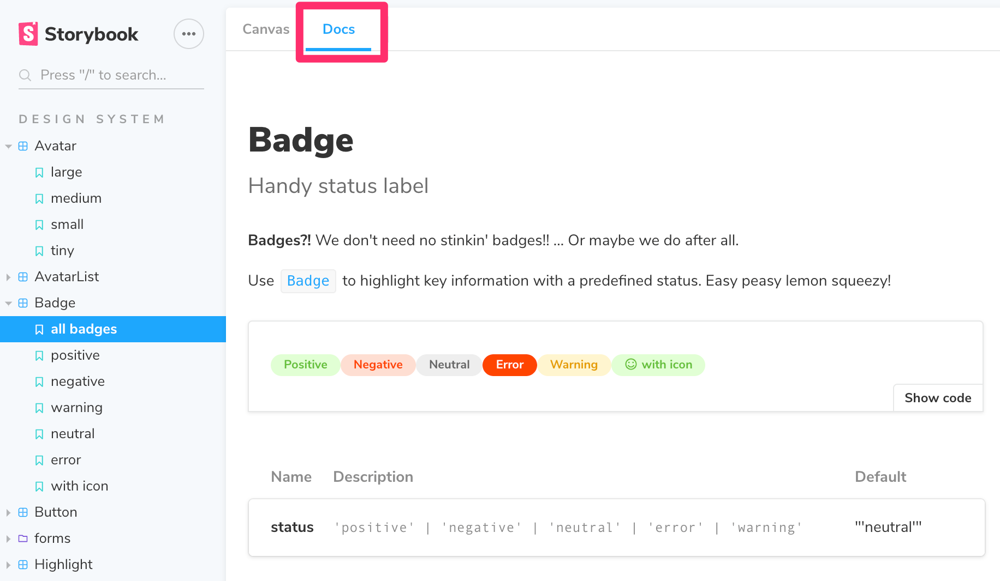
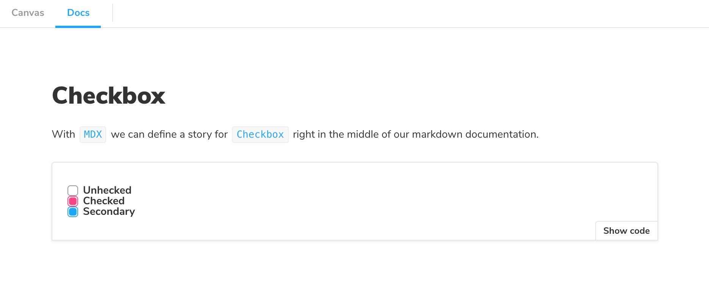

<center>
  
</center>

# Storybook Docs

Storybook Docs transforms your Storybook stories into world-class component documentation.

**DocsPage.** Out of the box, all your stories get a `DocsPage`. `DocsPage` is a zero-config aggregation of your component stories, text descriptions, docgen comments, props tables, and code examples into simple, easy-to-read pages.

**MDX.** If you want more control, `MDX` allows you to write long-form markdown documentation and stories in one file. You can also use it to write pure documentation pages and embed them inside your Storybook alongside your stories.

Just like Storybook, Docs supports every major view layer including React, Vue, Angular, HTML, Web components, Svelte, and many more.

Read on to learn more:

- [DocsPage](#docspage)
- [MDX](#mdx)
- [Framework support](#framework-support)
- [Installation](#installation)
- [Preset options](#preset-options)
- [Manual configuration](#manual-configuration)
- [TypeScript configuration](#typescript-configuration)
- [More resources](#more-resources)

## DocsPage

When you [install Docs](#installation), every story gets a `DocsPage`. `DocsPage` pulls information from your stories, components, source code, and story metadata to construct a sensible, zero-config default.

Click on the `Docs` tab to see it:

<center>
  
</center>

For more information on how it works, see the [`DocsPage` reference](./docs/docspage.md).

## MDX

`MDX` is a syntax for writing long-form documentation and stories side-by-side in the same file. In contrast to `DocsPage`, which provides smart documentation out of the box, `MDX` gives you full control over your component documentation.

Here's an example file:

```md
import { Meta, Story, Preview } from '@storybook/addon-docs/blocks';
import { Checkbox } from './Checkbox';

<Meta title="MDX|Checkbox" component={Checkbox} />

# Checkbox

With `MDX` we can define a story for `Checkbox` right in the middle of our
markdown documentation.

<Preview>
  <Story name="all checkboxes">
    <form>
      <Checkbox id="Unchecked" label="Unchecked" />
      <Checkbox id="Checked" label="Checked" checked />
      <Checkbox appearance="secondary" id="second" label="Secondary" checked />
    </form>
  </Story>
</Preview>
```

And here's how that's rendered in Storybook:

<center>
  
</center>

For more information on `MDX`, see the [`MDX` reference](./docs/mdx.md).

## Framework support

Storybook Docs supports all view layers that Storybook supports except for React Native (currently). There are some view-layer specific
features as well. This chart captures the current state of support

|                   | React | Vue | Angular | HTML | Svelte | Polymer | Marko | Mithril | Riot | Ember | Preact |
| ----------------- | :---: | :-: | :-----: | :--: | :----: | :-----: | :---: | :-----: | :--: | :---: | :----: |
| MDX stories       |   +   |  +  |    +    |  +   |   +    |    +    |   +   |    +    |  +   |   +   |   +    |
| CSF stories       |   +   |  +  |    +    |  +   |   +    |    +    |   +   |    +    |  +   |   +   |   +    |
| StoriesOf stories |   +   |  +  |    +    |  +   |   +    |    +    |   +   |    +    |  +   |   +   |   +    |
| Source            |   +   |  +  |    +    |  +   |   +    |    +    |   +   |    +    |  +   |   +   |   +    |
| Notes / Info      |   +   |  +  |    +    |  +   |   +    |    +    |   +   |    +    |  +   |   +   |   +    |
| Props table       |   +   |  #  |    #    |      |        |         |       |         |      |       |        |
| Docgen            |   +   |  #  |    #    |      |        |         |       |         |      |       |        |
| Inline stories    |   +   |  #  |         |      |        |         |       |         |      |       |        |

**Note:** `#` = WIP support

## Installation

First add the package. Make sure that the versions for your `@storybook/*` packages match:

```sh
yarn add -D @storybook/addon-docs
```

Docs has peer dependencies on `react` and `babel-loader`. If you want to write stories in MDX, you may need to add these dependencies as well:

```sh
yarn add -D react babel-loader
```

Then add the following to your `.storybook/presets.js` exports:

```js
module.exports = ['@storybook/addon-docs/react/preset'];
```

If you're not using `react`, replace it with your framework of choice corresponding to the Storybook package name, e.g. `angular` for `@storybook/angular` etc.

**Configure.** If you're migrating from an earlier version of Storybook and want to use `MDX`, you need to upgrade your Storybook config:

```js
import { configure } from '@storybook/react';

configure(require.context('../src', true, /\.stories\.(js|mdx)$/), module);
```

For more information on the new `configure`, see ["Loading stories"](https://github.com/storybookjs/storybook/blob/next/docs/src/pages/basics/writing-stories/index.md#loading-stories) in the Storybook documentation.

## Preset options

The `addon-docs` preset has a few configuration options that can be used to configure its babel/webpack loading behavior. Here's an example of how to use the preset with options:

```js
module.exports = [
  {
    name: '@storybook/addon-docs/react/preset',
    options: {
      configureJSX: true,
      babelOptions: {},
      sourceLoaderOptions: null,
    },
  },
];
```

The `configureJsx` option is useful when you're writing your docs in MDX and your project's babel config isn't already set up to handle JSX files. `babelOptions` is a way to further configure the babel processor when you're using `configureJSX`.

`sourceLoaderOptions` is an object for configuring `@storybook/source-loader`. When set to `null` it tells docs not to run the `source-loader` at all, which can be used as an optimization, or if you're already using `source-loader` in your `webpack.config.js`.

## Manual configuration

If you don't want to use the preset, and prefer to configure "the long way", first register the addon in `.storybook/addons.js`:

```js
import '@storybook/addon-docs/register';
```

Then configure Storybook's webpack loader in `.storybook/webpack.config.js` to understand MDX story files and annotate TS/JS story files with source code using `source-loader`:

```js
const createCompiler = require('@storybook/addon-docs/mdx-compiler-plugin');

module.exports = async ({ config }) => {
  config.module.rules.push({
    test: /\.(stories|story)\.mdx$/,
    use: [
      {
        loader: 'babel-loader',
        // may or may not need this line depending on your app's setup
        plugins: ['@babel/plugin-transform-react-jsx'],
      },
      {
        loader: '@mdx-js/loader',
        options: {
          compilers: [createCompiler({})],
        },
      },
    ],
  });
  config.module.rules.push({
    test: /\.(stories|story)\.[tj]sx?$/,
    loader: require.resolve('@storybook/source-loader'),
    exclude: [/node_modules/],
    enforce: 'pre',
  });
  return config;
};
```

Finally, you'll need to set up DocsPage in `.storybook/config.js`:

```js
import { addParameters } from '@storybook/react';
import { DocsPage, DocsContainer } from '@storybook/addon-docs/blocks';

addParameters({
  docs: {
    container: DocsContainer,
    page: DocsPage,
  },
});
```

## TypeScript configuration

SB Docs for React uses `babel-plugin-react-docgen` to extract Docgen comments from your code automatically. However, if you're using TypeScript, some extra configuration maybe required to get this information included in your docs.

1. You can add [react-docgen-typescript-loader](https://www.npmjs.com/package/react-docgen-typescript-loader) to your project by following the instructions there.
2. You can use [@storybook/preset-typescript](https://www.npmjs.com/package/@storybook/preset-typescript) which includes `react-docgen-typescript-loader`.

Install the preset with care. If you've already configured Typescript manually, that configuration may conflict with the preset. You can [debug your final webpack configuration with `--debug-webpack`](https://storybook.js.org/docs/configurations/custom-webpack-config/#debug-the-default-webpack-config).

## More resources

Want to learn more? Here are some more articles on Storybook Docs:

- References: [DocsPage](./docs/docspage.md) / [MDX](./docs/mdx.md) / [FAQ](./docs/faq.md) / [Recipes](./docs/recipes.md) / [Theming](./docs/theming.md)
- Vision: [Storybook Docs sneak peak](https://medium.com/storybookjs/storybook-docs-sneak-peak-5be78445094a)
- Announcement: [DocsPage](https://medium.com/storybookjs/storybook-docspage-e185bc3622bf)
- Example: [Storybook Design System](https://github.com/storybookjs/design-system)
- [Technical preview guide](https://docs.google.com/document/d/1un6YX7xDKEKl5-MVb-egnOYN8dynb5Hf7mq0hipk8JE/edit?usp=sharing)
