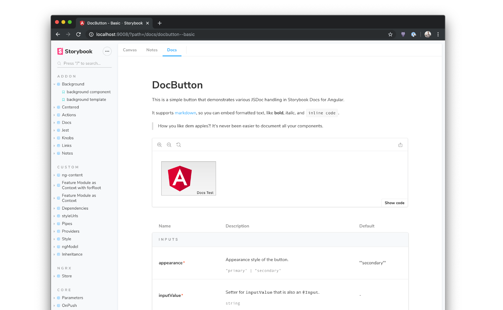

<center>
  
</center>

# Storybook Docs for Angular

Storybook Docs transforms your Storybook stories into world-class component documentation. Storybook Docs for Angular supports [DocsPage](../docs/docspage.md) for auto-generated docs, and [MDX](../docs/mdx.md) for rich long-form docs.

To learn more about Storybook Docs, read the [general documentation](../README.md). To learn the Angular specifics, read on!

- [Installation](#installation)
- [DocsPage](#docspage)
- [MDX](#mdx)
- [IFrame height](#iframe-height)
- [More resources](#more-resources)

## Installation

First add the package. Make sure that the versions for your `@storybook/*` packages match:

```sh
yarn add -D @storybook/addon-docs@next
```

Then add the following to your `.storybook/main.js` exports:

```js
module.exports = {
  addons: ['@storybook/addon-docs'],
};
```

## DocsPage

When you [install docs](#installation) you should get basic [DocsPage](../docs/docspage.md) documentation automagically for all your stories, available in the `Docs` tab of the Storybook UI.

Props tables for your components requires a few more steps. Docs for Angular relies on [Compodoc](https://compodoc.app/), the excellent API documentation tool. It supports `inputs`, `outputs`, `properties`, `methods`, `view/content child/children` as first class prop types.

To get this, you'll first need to install Compodoc:

```sh
yarn add -D @compodoc/compodoc
```

Then you'll need to configure Compodoc to generate a `documentation.json` file. Adding the following snippet to your `package.json` creates a metadata file `./documentation.json` each time you run storybook:

```json
{
  ...
  "scripts": {
    "docs:json": "compodoc -p ./tsconfig.json -e json -d .",
    "storybook": "npm run docs:json && start-storybook -p 9008 -s src/assets",
    ...
  },
}
```

Unfortunately, it's not currently possible to update this dynamically as you edit your components, but [there's an open issue](https://github.com/storybookjs/storybook/issues/8672) to support this with improvements to Compodoc.

Next, add the following to `.storybook/preview.ts` to load the Compodoc-generated file:

```js
import { setCompodocJson } from '@storybook/addon-docs/angular';
import docJson from '../documentation.json';
setCompodocJson(docJson);
```

Finally, be sure to fill in the `component` field in your story metadata:

```ts
import { AppComponent } from './app.component';

export default {
  title: 'App Component',
  component: AppComponent,
};
```

If you haven't upgraded from `storiesOf`, you can use a parameter to do the same thing:

```ts
import { storiesOf } from '@storybook/angular';
import { AppComponent } from './app.component';

storiesOf('App Component', module)
  .addParameters({ component: AppComponent })
  .add( ... );
```

## MDX

[MDX](../docs/mdx.md) is a convenient way to document your components in Markdown and embed documentation components, such as stories and props tables, inline.

Docs has peer dependencies on `react`, `react-is`, and `babel-loader`. If you want to write stories in MDX, you'll need to add these dependencies as well:

```sh
yarn add -D react react-is babel-loader
```

Then update your `.storybook/main.js` to make sure you load MDX files:

```ts
module.exports = {
  stories: ['../src/stories/**/*.stories.(js|mdx)'],
};
```

Finally, you can create MDX files like this:

```md
import { Meta, Story, Props } from '@storybook/addon-docs/blocks';
import { AppComponent } from './app.component';

<Meta title='App Component' component={AppComponent} />

# App Component

Some **markdown** description, or whatever you want.

<Story name='basic' height='400px'>{{
  component: AppComponent,
  props: {},
}}</Story>

## Props

<Props of={AppComponent} />
```

Yes, it's redundant to declare `component` twice. [Coming soon](https://github.com/storybookjs/storybook/issues/8673).

Also, to use the `Props` doc block, you need to set up Compodoc, [as described above](#docspage).

## IFrame height

Storybook Docs renders all Angular stories inside IFrames, with a default height of `60px`. You can update this default globally, or modify the IFrame height locally per story in `DocsPage` and `MDX`.

To update the global default, modify `.storybook/preview.ts`:

```ts
import { addParameters } from '@storybook/angular';

addParameters({ docs: { iframeHeight: 400 } });
```

For `DocsPage`, you need to update the parameter locally in a story:

```ts
export const basic = () => ...
basic.story = {
  parameters: { docs: { iframeHeight: 400 } }
}
```

And for `MDX` you can modify it as an attribute on the `Story` element:

```md
<Story name='basic' height='400px'>{...}</Story>
```

## More resources

Want to learn more? Here are some more articles on Storybook Docs:

- References: [DocsPage](../docs/docspage.md) / [MDX](../docs/mdx.md) / [FAQ](../docs/faq.md) / [Recipes](../docs/recipes.md) / [Theming](../docs/theming.md)
- Vision: [Storybook Docs sneak peak](https://medium.com/storybookjs/storybook-docs-sneak-peak-5be78445094a)
- Announcement: [DocsPage](https://medium.com/storybookjs/storybook-docspage-e185bc3622bf)
- Example: [Storybook Design System](https://github.com/storybookjs/design-system)
