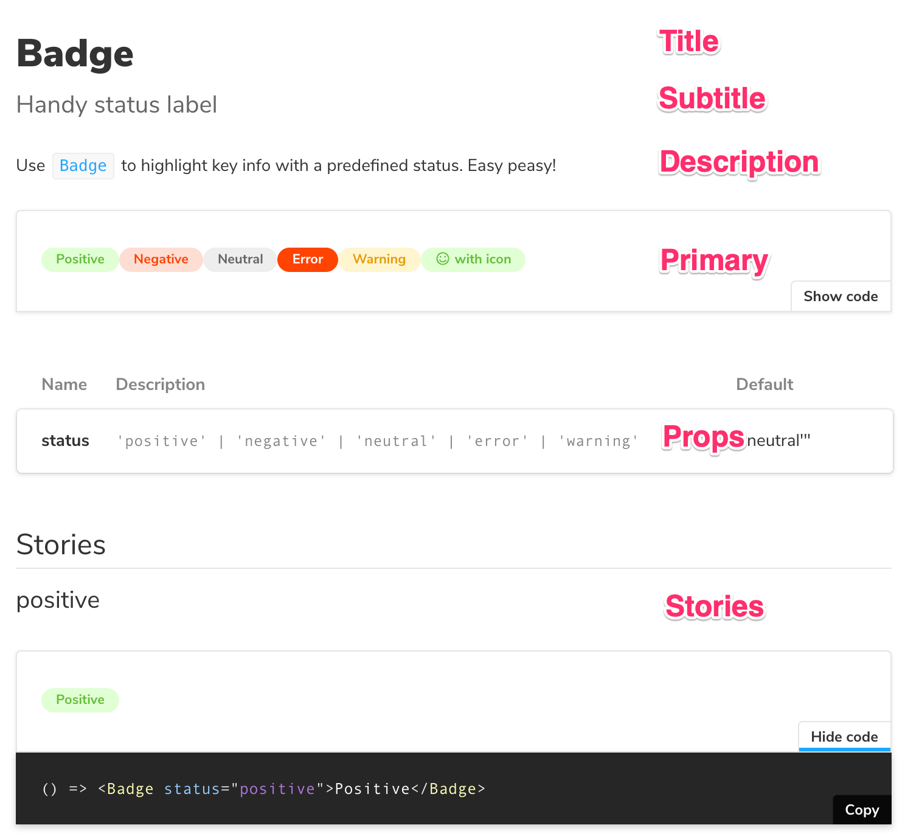

<center>
  
</center>

# Storybook DocsPage

When you install [Storybook Docs](../README.md), `DocsPage` is the zero-config default documentation that all stories get out of the box. It aggregates your stories, text descriptions, docgen comments, props tables, and code examples into a single page for each component.

- [Motivation](#motivation)
- [Component parameter](#component-parameter)
- [DocsPage slots](#docspage-slots)
- [Replacing DocsPage](#replacing-docspage)
- [Story file names](#story-file-names)
- [More resources](#more-resources)

## Motivation

`DocsPage` is the successor to [`addon-info`](https://github.com/storybookjs/storybook/tree/next/addons/info), which was one of the most popular Storybook addons despite many limitations.

Like `addon-info`, `DocsPage` provides sensible defaults, meaning it adds documentation to your existing Storybook without requiring any additional work on your part.

However, `DocsPage` brings the following improvements:

- It supports all frameworks that Storybook supports, including React, Vue, Angular and [many others](../README.md#framework-support).
- It generates better documentation that can be used as a standalone docs site, independently of Storybook.
- It supports better configuration, so you can capture project specific information with ease.
- It's built to work with [`MDX`](./mdx.md) when you need more control of your documentation.

## Component parameter

`DocsPage` pulls info from many sources, but one of the main ones is the `component` parameter, which is a new addition to Storybook in 5.2. It's based on the best practice that each component should have an associated set of documentation and stories (versus organizing it in some other way).

Storybook uses `component` to extract the component's description and props, and will rely on it further in future releases. We encourage you to add it to existing stories and use it in all new stories.

Here's how to set the component in [Component Story Format (CSF)](https://storybook.js.org/docs/formats/component-story-format/):

```js
import { Badge } from './Badge';

export default {
  title: 'Path/to/Badge',
  component: Badge,
};
```

And here's how to do the same thing the underlying `storiesOf` API:

```js
import { storiesOf } from '@storybook/react';
import { Badge } from './Badge';

storiesOf('Path/to/Badge', module).addParameters({ component: Badge });
```

If you're coming from the `storiesOf` format, there's [a codemod that adds it for you](https://github.com/storybookjs/storybook/blob/next/lib/codemod/README.md#add-component-parameters).

## DocsPage slots

`DocsPage` is organized into a series of "slots" including Title, Subtitle, Description, Props, and Story. Each of these slots pulls information from your project and formats it for the screen.

<center>
  
</center>

## Slot values

Each of the slots is computed by a built-in function, that can also be overridden using [Slot Function](#slot-functions).

Here is a summary of the slots, where the data comes from by default, and the slot function that can be used to override it:

| Slot        | Default source                      | Slot function     | Frameworks |
| ----------- | ----------------------------------- | ----------------- | ---------- |
| Title       | component `title`                   | `titleSlot`       | All        |
| Subtitle    | `componentSubtitle` parameter       | `subtitleSlot`    | All        |
| Description | component `docgen` comment          | `descriptionSlot` | React, Vue |
| Primary     | storybook stories                   | `primarySlot`     | All        |
| Props       | component docgen props or propTypes | `propsSlot`       | React, Vue |
| Stories     | storybook stories                   | `storiesSlot`     | All        |

For more information on frameworks, see ["Framework support"](../README.md#framework-support)

### Title

`Title` is computed from the component's `title`, and matches the component caption in Storybook's navigation.

For example:

```js
export default {
  title: 'Path/to/Badge',
};
```

### Subtitle

The `Subtitle` slot is computed from the component's `componentSubtitle` parameter.

For example in [Component Story Format (CSF)](https://medium.com/storybookjs/component-story-format-66f4c32366df):

```js
export default {
  ...
  parameters: {
    componentSubtitle: 'Handy status label',
  },
};
```

### Description

The `Description` slot is computed from the Component's docgen comments in the component's source.

For example, here's the source for `Badge`:

```js
/**
 * Use `Badge` to highlight key info with a predefined status. Easy peasy!
 */
export const Badge = ({ status, children }) => { ... }
```

### Primary

The `Primary` slot is computed from the first user-defined story for the component.

For example here are `Badge`'s stories in CSF. The `allBadges` is selected as the primary story because it's first:

```js
// export default { ... }; /* Badge component metadata */
export const allBadges = () => ...
export const positive = () => ...
export const negative = () => ...
```

### Props

The `Props` slot is computed from the component's docgen props, which can be defined in typescript or using `react` PropTypes.

For example, here are the `PropTypes` for the `Badge` component

```js
import PropTypes from 'prop-types';

// ... Badge definition ...

Badge.propTypes = {
  status: PropTypes.oneOf(['positive', 'negative', 'neutral', 'error', 'warning']),
};
Badge.defaultProps = {
  status: 'neutral',
};
```

### Stories

The `Stories` slot is computed from the user-defined stories for the component, excluding the first.

For example here are `Badge`'s stories in CSF. The `positive` and `negative` stories are selected in that order:

```js
// export default { ... }; /* Badge component metadata */
export const allBadges = () => ...
export const positive = () => ...
export const negative = () => ...
```

## Slot functions

> ⚠️ Slot functions are an experimental feature in Storybook 5.2. The API may change in 5.3 outside of the normal semver rules. Be forewarned!

The value for each slot is computed from a `SlotContext` context, and the function that's used to compute the value can be overridden if you need to customize the page. If you find yourself doing a lot of configuration, or wanting different configurations for different pages, you might be better off using `MDX`. Everything that `DocsPage` gives you can be reconstructed in a few lines of `MDX`.

Here is the `SlotContext` type definition:

```ts
export interface SlotContext {
  id?: string;
  selectedKind?: string;
  selectedStory?: string;
  parameters?: any;
  storyStore?: any;
}
```

And here are the return type signatures for each of the slot functions

| Slot     | Function     | Inputs                       | Output             |
| -------- | ------------ | ---------------------------- | ------------------ |
| Title    | titleSlot    | `SlotContext`                | `string?`          |
| Subtitle | subtitleSlot | `SlotContext`                | `string?`          |
| Primary  | primarySlot  | `StoryData[]`, `SlotContext` | `StoryProps?`      |
| Props    | propsSlot    | `SlotContext`                | `PropsTableProps?` |
| Stories  | storiesSlot  | `StoryData[]`, `SlotContext` | `StoryProps[]?`    |

## Replacing DocsPage

What if you don't want a `DocsPage` for your storybook, for a specific component, or even for a specific story?

You can replace DocsPage at any level by overriding the `docs.page` parameter:

- With `null` to remove docs
- [With MDX](./recipes.md#csf-stories-with-mdx-docs) docs
- With a custom React component

**Globally (config.js)**

```js
import { addParameters } from '@storybook/react';
addParameters({ docs: { page: null } });
```

**Component-level (Button.stories.js)**

```js
import { Button } from './Button';
export default {
  title: 'Demo/Button',
  component: Button,
  parameters: { docs: { page: null } },
};
```

**Story-level (Button.stories.js)**

```js
import { Button } from './Button';
// export default { ... }
export const basic => () => <Button>Basic</Button>
basic.story = {
  parameters: { docs: { page: null } }
}
```

## Story file names

Unless you use a custom webpack configuration, all of your story files should have the suffix `*.stories.[jt]sx?`, e.g. `"Badge.stories.js"`, `"Badge.stories.tsx"`, etc.

The docs preset assumes this naming convention for its `source-loader` setup. If you want to use a different naming convention, you'll need a [manual configuration](../README.md#manual-configuration).

## More resources

Want to learn more? Here are some more articles on Storybook Docs:

- References: [README](../README.md) / [MDX](mdx.md) / [FAQ](faq.md) / [Recipes](recipes.md) / [Theming](theming.md)
- Vision: [Storybook Docs sneak peak](https://medium.com/storybookjs/storybook-docs-sneak-peak-5be78445094a)
- Announcement: [DocsPage](https://medium.com/storybookjs/storybook-docspage-e185bc3622bf)
- Example: [Storybook Design System](https://github.com/storybookjs/design-system)
- [Technical preview guide](https://docs.google.com/document/d/1un6YX7xDKEKl5-MVb-egnOYN8dynb5Hf7mq0hipk8JE/edit?usp=sharing)
