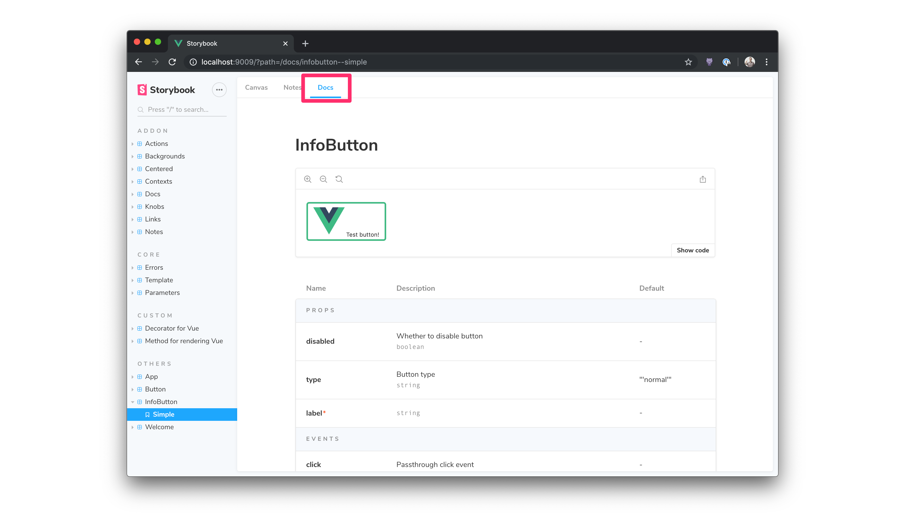

<center>
  
</center>

# Storybook Docs for Vue

Storybook Docs transforms your Storybook stories into world-class component documentation. Storybook Docs for Vue supports [DocsPage](../docs/docspage.md) for auto-generated docs, and [MDX](../docs/mdx.md) for rich long-form docs.

To learn more about Storybook Docs, read the [general documentation](../README.md). To learn the Vue specifics, read on!

- [Installation](#installation)
- [DocsPage](#docspage)
- [MDX](#mdx)
- [Inline stories](#inline-stories)
- [More resources](#more-resources)

## Installation

First add the package. Make sure that the versions for your `@storybook/*` packages match:

```sh
yarn add -D @storybook/addon-docs@next
```

Then add the following to your `.storybook/main.js` addons:

```js
module.exports = {
  addons: ['@storybook/addon-docs'],
};
```

## DocsPage

When you [install docs](#installation) you should get basic [DocsPage](../docs/docspage.md) documentation automagically for all your stories, available in the `Docs` tab of the Storybook UI.

Props tables for your components requires a few more steps. Docs for Vue relies on [Addon-vue-info](https://github.com/pocka/storybook-addon-vue-info)'s loader. It supports `props`, `events`, and `slots` as first class prop types.

Finally, be sure to fill in the `component` field in your story metadata:

```ts
import { InfoButton } from './InfoButton.vue';

export default {
  title: 'InfoButton',
  component: InfoButton,
};
```

If you haven't upgraded from `storiesOf`, you can use a parameter to do the same thing:

```ts
import { storiesOf } from '@storybook/vue';
import { InfoButton } from './InfoButton.vue';

storiesOf('InfoButton', module)
  .addParameters({ component: InfoButton })
  .add( ... );
```

## MDX

[MDX](../docs/mdx.md) is a convenient way to document your components in Markdown and embed documentation components, such as stories and props tables, inline.

Docs has peer dependencies on `react`, `react-is`, and `babel-loader`. If you want to write stories in MDX, you'll need to add these dependencies as well:

```sh
yarn add -D react react-is babel-loader
```

Then update your `.storybook/main.js` to make sure you load MDX files:

```js
module.exports = {
  stories: ['../src/stories/**/*.stories.(js|mdx)'],
};
```

Finally, you can create MDX files like this:

```md
import { Meta, Story, Props } from '@storybook/addon-docs/blocks';
import { InfoButton } from './InfoButton.vue';

<Meta title='InfoButton' component={InfoButton} />

# InfoButton

Some **markdown** description, or whatever you want.

<Story name='basic' height='400px'>{{
  components: { InfoButton },
  template: '<info-button label="I\'m a button!"/>',
}}</Story>

## Props

<Props of={InfoButton} />
```

Yes, it's redundant to declare `component` twice. [Coming soon](https://github.com/storybookjs/storybook/issues/8685).

## Inline Stories

Storybook Docs renders all Vue stories inside IFrames, with a default height of `60px` (configurable using the `docs.iframeHeight` story parameter).

Starting in 5.3, you can also render stories inline, and in 6.0 this will become the default behavior. To render inline, update `.storybook/preview.js`:

```js
import { addParameters } from '@storybook/vue';

addParameters({
  docs: {
    inlineStories: true,
  },
});
```

## More resources

Want to learn more? Here are some more articles on Storybook Docs:

- References: [DocsPage](../docs/docspage.md) / [MDX](../docs/mdx.md) / [FAQ](../docs/faq.md) / [Recipes](../docs/recipes.md) / [Theming](../docs/theming.md)
- Vision: [Storybook Docs sneak peak](https://medium.com/storybookjs/storybook-docs-sneak-peak-5be78445094a)
- Announcement: [DocsPage](https://medium.com/storybookjs/storybook-docspage-e185bc3622bf)
- Example: [Storybook Design System](https://github.com/storybookjs/design-system)
