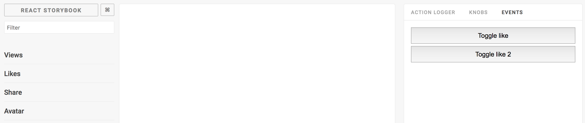

# Storybook Addon Events

This [Storybook](https://getstorybook.io) addon allows you to add events for your stories.


[Storybook Addon Events Live Demo](https://z4o4z.github.io/storybook-addon-events/index.html)

### Getting Started
**note: addons require @kadira/storybook 2.x or greater*

```sh
npm i --save-dev @z4o4z/storybook-addon-events
```

Then create a file called `addons.js` in your storybook config.

Add following content to it:

```js
import '@kadira/storybook/addons';
import '@z4o4z/storybook-addon-events/register';
```

Then write your stories like this:

```js
import React from 'react';
import EventEmiter from 'event-emiter';
import { storiesOf } from '@kadira/storybook';
import WithEvents from '@z4o4z/storybook-addon-events';

import Logger from './Logger';
import * as EVENTS from './events';

const emiter = new EventEmiter();
const emit = emiter.emit.bind(emiter);


storiesOf('WithEvents', module)
  .addDecorator(getStory => (
    <WithEvents
      emit={emit}
      events={[
        {
          name: EVENTS.TEST_EVENT_1,
          title: 'Test event 1',
          payload: 0,
        },
        {
          name: EVENTS.TEST_EVENT_2,
          title: 'Test event 2',
          payload: 'asdasdad asdasdasd',
        },
        {
          name: EVENTS.TEST_EVENT_3,
          title: 'Test event 3',
          payload: {
            string: 'value',
            number: 123,
            array: [1, 2, 3],
            object: {
              string: 'value',
              number: 123,
              array: [1, 2, 3],
            },
          },
        },
        {
          name: EVENTS.TEST_EVENT_4,
          title: 'Test event 4',
          payload: [
            {
              string: 'value',
              number: 123,
              array: [1, 2, 3],
            },
            {
              string: 'value',
              number: 123,
              array: [1, 2, 3],
            },
            {
              string: 'value',
              number: 123,
              array: [1, 2, 3],
            },
          ],
        },
      ]}
    >
      {getStory()}
    </WithEvents>
  ))
  .add('Logger', () => <Logger emiter={emiter} />);
```
