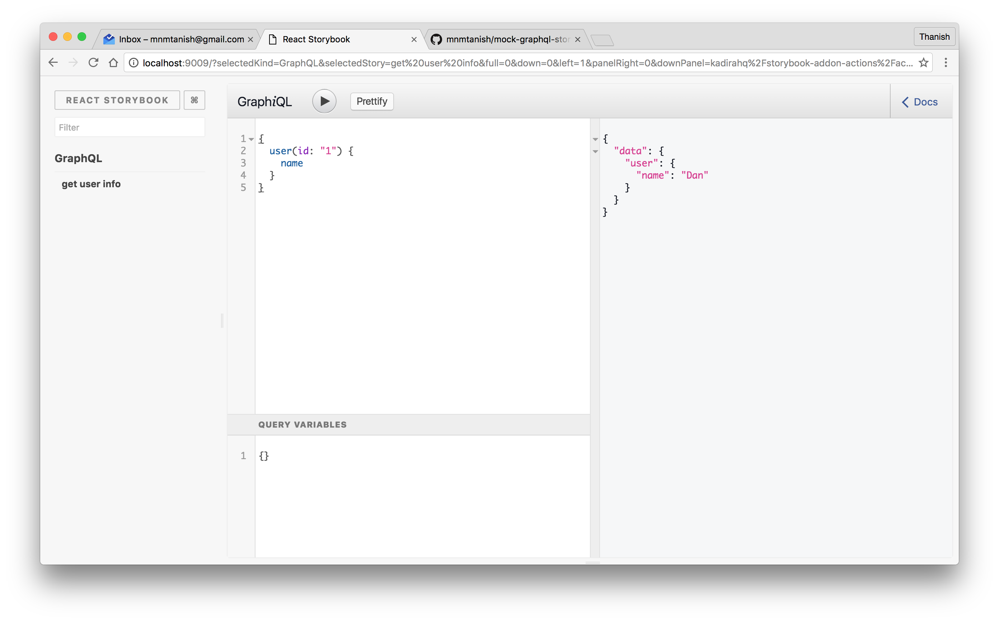

# Storybook GraphiQL Addon

[](https://circleci.com/gh/storybooks/storybook)
[](https://www.codefactor.io/repository/github/storybooks/storybook)
[](https://snyk.io/test/github/storybooks/storybook/8f36abfd6697e58cd76df3526b52e4b9dc894847)
[](https://bettercodehub.com/results/storybooks/storybook) [](https://codecov.io/gh/storybooks/storybook)  
[](https://now-examples-slackin-rrirkqohko.now.sh/)
[](#backers) [](#sponsors)

* * *

Storybook GraphQL Addon can be used to display the GraphiQL IDE with example queries in [Storybook](https://storybook.js.org).

This addon works with Storybook for:
- [React](https://github.com/storybooks/storybook/tree/master/app/react)



## Getting Started

First, install the addon

```sh
npm install -D @storybook/addon-graphql
```

Import the `setupGraphiQL` function and use it to create the graphiql helper with a base url.

```js
import { storiesOf } from '@storybook/react'
import { setupGraphiQL } from '@storybook/addon-graphql'

// setup the graphiql helper which can be used with the add method later
const graphiql = setupGraphiQL({ url: 'http://localhost:3000/graphql' });

storiesOf('GraphQL Demo', module)
  .add('get user info', graphiql(`{
    user(id: "1") {
      name
    }
  }`));
```

> Tip: try creating the helper in another file and import the configured graphiql helper from it

## Advanced Setup

The `setupGraphiQL` function also accepts a fetcher parameter which can be used to change how graphiql gets data. If the fetcher parameter is not given, it'll create a fetcher which uses the `fetch` api to make requests. The above example can also be written using a custom fetcher.

```js
import { storiesOf } from '@storybook/react'
import { setupGraphiQL } from '@storybook/addon-graphql'

import { url } from './settings';

const fetcher = params => {
  const options = {
    method: 'post',
    headers: { 'Content-Type': 'application/json' },
    body: JSON.stringify(params),
  };
  return fetch(url, options).then(res => res.json());
};

// create the helper with a custom fetcher
const graphiql = setupGraphiQL({ fetcher });

storiesOf('GraphQL Demo', module)
  .add('get user info', graphiql(`{
    user(id: "1") {
      name
    }
  }`));
```
