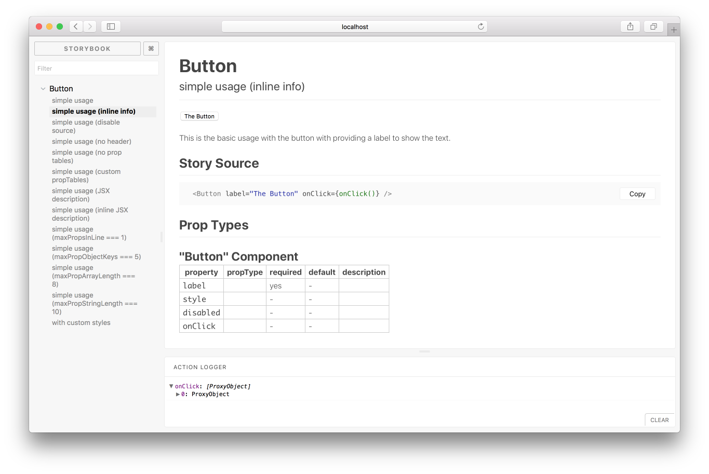

# Storybook Info Addon

[](https://greenkeeper.io/)
[](https://travis-ci.org/storybooks/storybook)
[](https://www.codefactor.io/repository/github/storybooks/storybook)
[](https://snyk.io/test/github/storybooks/storybook/8f36abfd6697e58cd76df3526b52e4b9dc894847)
[](https://bettercodehub.com/results/storybooks/storybook) [](https://codecov.io/gh/storybooks/storybook)
[](https://storybooks-slackin.herokuapp.com/)

Storybook Info Addon will show additional information for your stories in [Storybook](https://storybook.js.org).
Useful when you want to display usage or other types of documentation alongside your story.

This addon works with Storybook for:
[React](https://github.com/storybooks/storybook/tree/master/app/react).



## Installation

Install the following npm module:

```sh
npm i -D @storybook/addon-info
```

## Basic usage

Then wrap your story with the `withInfo`, which is a function that takes either
documentation text or an options object:

```js
import { withInfo } from '@storybook/addon-info';

storiesOf('Component', module)
  .add('simple info',
    withInfo('doc string about my component')(() =>
      <Component>Click the "?" mark at top-right to view the info.</Component>
    )
  )
```

## Usage with options

`withInfo` can also take an [options object](#global-options) in case you want to configure how
the info panel looks on a per-story basis:

```js
import { withInfo } from '@storybook/addon-info';

storiesOf('Component', module)
  .add('simple info',
    withInfo({
      text: 'String or React Element with docs about my component', // Warning! This option's name will be likely renamed to "summary" in 3.3 release. Follow this PR #1501 for details
      // other possible options see in Global options section below
    )(() =>
      <Component>Click the "?" mark at top-right to view the info.</Component>
    )
  )
```

## Usage as decorator

It is possible to add infos by default to all components by using a global or story decorator. The drawback is you won't be able to display a distinct info message per story.

It is important to declare this decorator as **the first decorator**, otherwise it won't work well.

    addDecorator((story, context) => withInfo('common info')(story)(context));

## Global options

To configure default options for all usage of the info option, use `setDefaults` in `.storybook/config.js`:

```js
// config.js
import { setDefaults } from '@storybook/addon-info';

// addon-info
setDefaults({
  header: false, // Toggles display of header with component name and description
  inline: true, // Displays info inline vs click button to view
  source: true, // Displays the source of story Component
  propTables: [/* Components used in story */], // displays Prop Tables with this components
  propTablesExclude: [], // Exclude Components from being shoun in Prop Tables section
  styles: {}, // Overrides styles of addon
  marksyConf: {}, // Overrides components used to display markdown. Warning! This option's name will be likely deprecated in favor to "components" with the same API in 3.3 release. Follow this PR #1501 for details
  maxPropsIntoLine: 1, // Max props to display per line in source code
  maxPropObjectKeys: 10,
  maxPropArrayLength: 10,
  maxPropStringLength: 100,
});
```

## Deprecated usage

There is also a deprecated API that is slated for removal in Storybook 4.0.

```js
import { configure, setAddon } from '@storybook/react';
import infoAddon from '@storybook/addon-info';

setAddon(infoAddon);

configure(function () {
  //...
}, module);
```

Then create your stories with the `.addWithInfo` API.

```js
import React from 'react';
import { storiesOf } from '@storybook/react';
import Component from './Component';

storiesOf('Component')
  .addWithInfo(
    'simple usage',
    `This is the basic usage with the button with providing a label to show the text.`,
    () => (
      <Component>Click the "?" mark at top-right to view the info.</Component>
    ),
  );
```

> Have a look at [this example](example/story.js) stories to learn more about the `addWithInfo` API.

To customize your defaults:

```js
// config.js
import infoAddon, { setDefaults } from '@storybook/addon-info';

// addon-info
setDefaults({
  inline: true,
  maxPropsIntoLine: 1,
  maxPropObjectKeys: 10,
  maxPropArrayLength: 10,
  maxPropStringLength: 100,
});
setAddon(infoAddon);
```

### React Docgen Integration

React Docgen is included as part of the @storybook/react package through the use of `babel-plugin-react-docgen` during babel compile time.
When rendering a story with a React component commented in this supported format, the Addon Info prop table will display the prop's comment in the description column.

```js
import React from 'react';
import PropTypes from 'prop-types';

/** Button component description */
const DocgenButton = ({ disabled, label, style, onClick }) =>
  <button disabled={disabled} style={style} onClick={onClick}>
    {label}
  </button>;

DocgenButton.defaultProps = {
  disabled: false,
  onClick: () => {},
  style: {},
};

DocgenButton.propTypes = {
  /** Boolean indicating whether the button should render as disabled */
  disabled: PropTypes.bool,
  /** button label. */
  label: PropTypes.string.isRequired,
  /** onClick handler */
  onClick: PropTypes.func,
  /** component styles */
  style: PropTypes.shape,
};

export default DocgenButton;
```
Comments above flow types are also supported. Storybook Info Addon should now render all the correct types for your component if the PropTypes are in the same file as the React component.

## The FAQ

**Components lose their names on static build**

Component names also get minified with other javascript code when building for production.
When creating components, set the `displayName` static property to show the correct component name on static builds.
