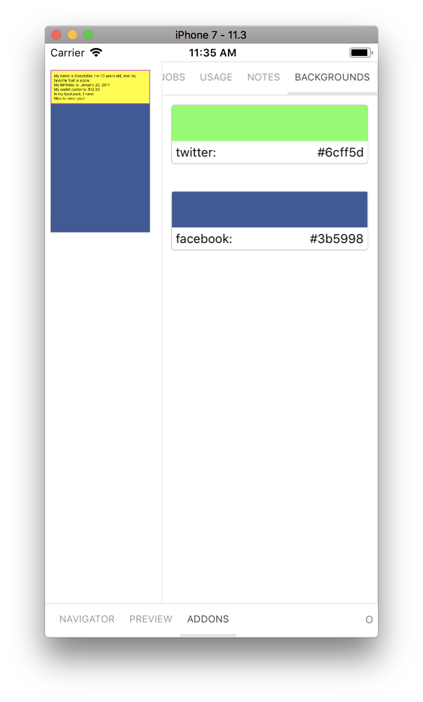

# Storybook Addon On Device Backgrounds

Storybook On Device Background Addon can be used to change background colors inside the the simulator in [Storybook](https://storybook.js.org).

[Framework Support](https://github.com/storybooks/storybook/blob/master/ADDONS_SUPPORT.md)



## Installation

```sh
npm i -D @storybook/addon-ondevice-backgrounds
```

## Configuration

Then create a file called `rn-addons.js` in your storybook config.

Add following content to it:

```js
import '@storybook/addon-ondevice-backgrounds/register';
```

Then import `rn-addons.js` next to your `getStorybookUI` call.
```js
import './rn-addons';
```


## Usage

Then write your stories like this:

```js
import React from 'react';
import { storiesOf } from '@storybook/react-native';
import { withBackgrounds } from '@storybook/addon-ondevice-backgrounds';

storiesOf('Button', module)
  .addDecorator(
    withBackgrounds([
      { name: 'twitter', value: '#00aced', default: true },
      { name: 'facebook', value: '#3b5998' },
    ])
  )
  .add('with text', () => <Text>Click me</Text>);
```

You can add the backgrounds to all stories with `addDecorator` in `.storybook/config.js`:

```js
import { addDecorator } from '@storybook/react-native'; // <- or your storybook framework
import { withBackgrounds } from '@storybook/addon-ondevice-backgrounds';

addDecorator(
  withBackgrounds([
    { name: 'twitter', value: '#00aced', default: true },
    { name: 'facebook', value: '#3b5998' },
  ])
);
```

If you want to override backgrounds for a single story or group of stories, pass the `backgrounds` parameter:

```js
import React from 'react';
import { storiesOf } from '@storybook/react-native';

storiesOf('Button', module)
  .addParameters({
    backgrounds: [
      { name: 'red', value: '#F44336' },
      { name: 'blue', value: '#2196F3', default: true },
    ],
  })
  .add('with text', () => <button>Click me</button>);
```

If you don't want to use backgrounds for a story, you can set the `backgrounds` parameter to `[]`, or use `{ disable: true }` to skip the addon:

```js
import React from 'react';
import { storiesOf } from '@storybook/react-native';

storiesOf('Button', module).add('with text', () => <button>Click me</button>, {
  backgrounds: { disable: true },
});
```
