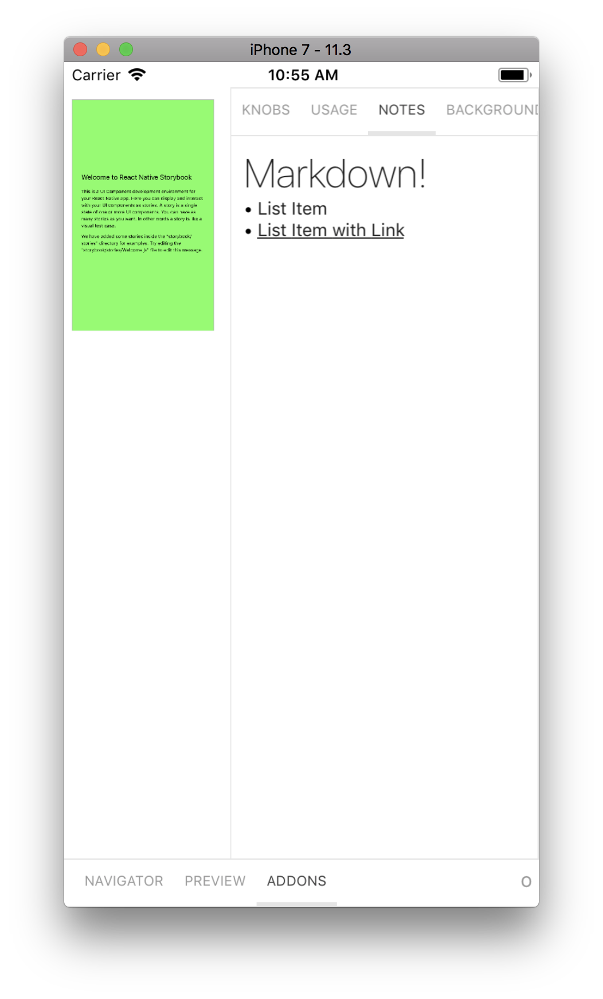

# Storybook Notes Addon for react-native

The Notes Addon allows you to write notes (text or markdown) for your stories in [Storybook](https://storybook.js.org).



## Installation

```sh
yarn add -D @storybook/addon-ondevice-notes
```

## Configuration

Create a file called `rn-addons.js` in your storybook config.

Add following content to it:

```js
import '@storybook/addon-ondevice-notes/register';
```

Then import `rn-addons.js` next to your `getStorybookUI` call.

```js
import './rn-addons';
```

## Usage

Use the `notes` parameter to add a note to stories:

```js
import { storiesOf } from '@storybook/react-native';

import Component from './Component';

storiesOf('Component', module).add('with some emoji', () => <Component />, {
  notes: 'A very simple component',
});
```

See the [crna-kitchen-sink app](../../examples-native/crna-kitchen-sink) for more examples.
