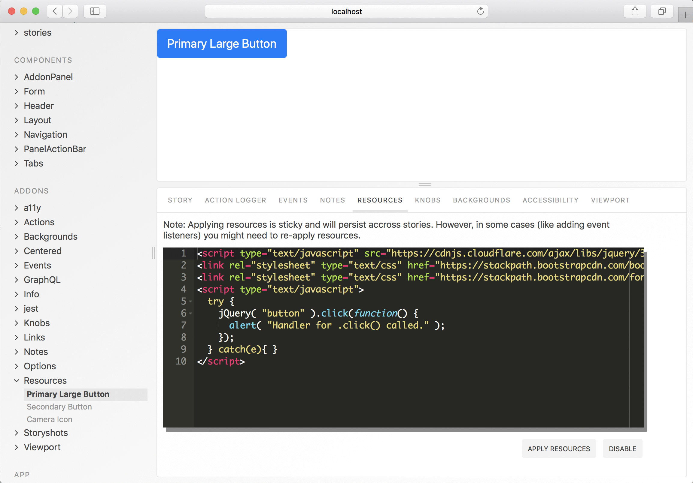

# Storybook Addon Resources

Storybook Addon Resources allows you dynamically add/remove (css and js) resources to the component iframe [Storybook](https://storybook.js.org).

[Framework Support](https://github.com/storybooks/storybook/blob/master/ADDONS_SUPPORT.md)



### Getting Started
**NOTE: Documentation on master branch is for alpha version, stable release is on [release/3.4](https://github.com/storybooks/storybook/tree/release/3.4/addons/)**

```sh
yarn add -D @storybook/addon-resources
```

Then create a file called `addons.js` in your storybook config.

Add following content to it:

```js
import '@storybook/addon-resources/register';
```

(Optionally), you could add initial resources using the `withResources` decorator. You can change these from the resources addon ui:

```js
// Import from @storybook/X where X is your framework
import { configure, addDecorator } from '@storybook/react';
import { withResources } from '@storybook/addon-resources';

addDecorator(
  withResources({
    resources: `<script type="text/javascript" src="https://cdnjs.cloudflare.com/ajax/libs/jquery/3.3.1/jquery.min.js"></script>
<link rel="stylesheet" type="text/css" href="https://stackpath.bootstrapcdn.com/bootstrap/4.1.3/css/bootstrap.min.css"></link>`,
  })
);
```

#### Some things to keep in mind

* Resources added/removed will be sticky (meaning they will persist across stories) and won't change any of the resources added statically (via preview-head.html).
* Resources can be set just once using the withResources decorator (,so calling withResources multiple times will have no affect). You can change them from the ui as many times as needed.
* In some cases (like adding event listeners on components) you might need to re-apply resources for the story.
