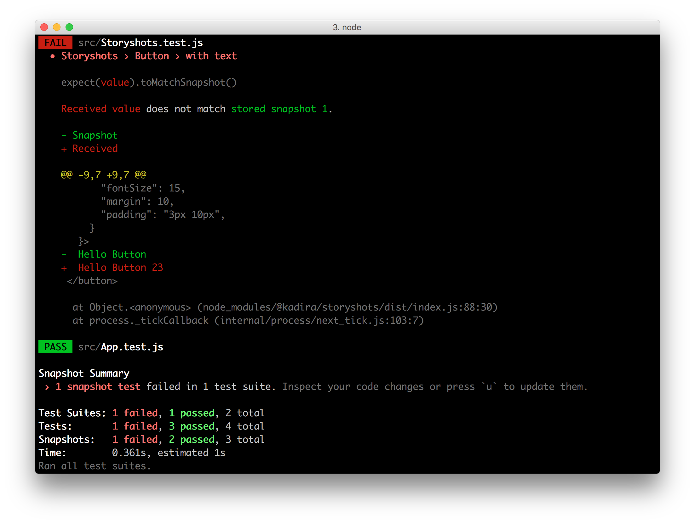
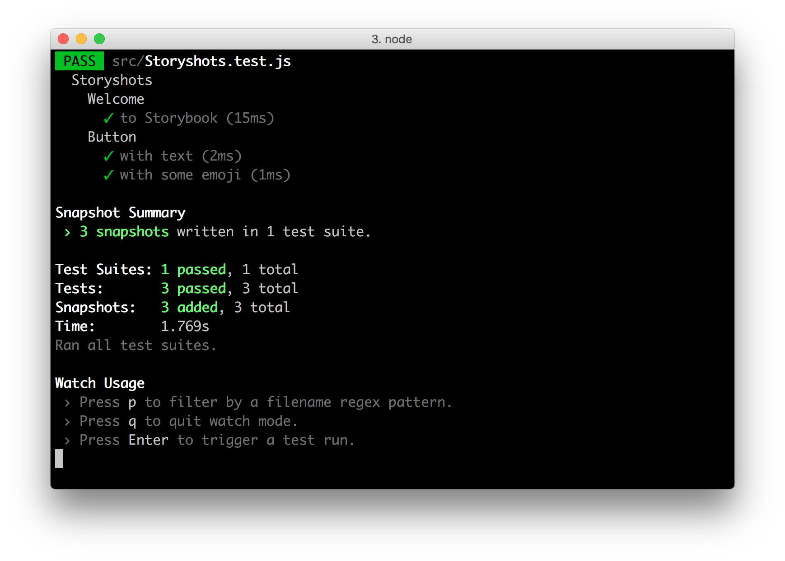

# StoryShots

StoryShots adds automatic Jest Snapshot Testing for [Storybook](https://storybook.js.org/).

[Framework Support](https://github.com/storybooks/storybook/blob/master/ADDONS_SUPPORT.md)



To use StoryShots, you must use your existing Storybook stories as the input for Jest Snapshot Testing.

## Getting Started

Add the following module into your app.

```sh
yarn add @storybook/addon-storyshots --dev
```

## Configure your app for Jest
In many cases, for example Create React App, it's already configured for Jest. You just need to create a filename with the extension `.test.js`.

If you still need to configure jest you can use the resources mentioned below:

-   [Getting Started - Jest Official Documentation](https://facebook.github.io/jest/docs/en/getting-started.html)
-   [Javascript Testing with Jest - Egghead](https://egghead.io/lessons/javascript-test-javascript-with-jest). ***paid content***

> Note: If you use React 16, you'll need to follow [these additional instructions](https://github.com/facebook/react/issues/9102#issuecomment-283873039).
>
> Note: Make sure you have added the ```json``` extention to ```moduleFileExtensions``` in ```jest.config.json```. If this is missing it leads to the [following error](https://github.com/storybooks/storybook/issues/3728): ```Cannot find module 'spdx-license-ids' from 'scan.js'```.
>
> Note: Please make sure you are using ```jsdom``` as the testEnvironment on your jest config file.


### Configure Jest to work with Webpack's [require.context()](https://webpack.js.org/guides/dependency-management/#require-context)

Sometimes it's useful to configure Storybook with Webpack's require.context feature:

```js
import { configure } from '@storybook/react';

const req = require.context('../stories', true, /\.stories\.js$/); // <- import all the stories at once

function loadStories() {
  req.keys().forEach(filename => req(filename));
}

configure(loadStories, module);
```

The problem here is that it will work only during the build with webpack,
other tools may lack this feature. Since Storyshot is running under Jest,
we need to polyfill this functionality to work with Jest. The easiest
way is to integrate it to babel.

You can do this with a Babel [plugin](https://github.com/smrq/babel-plugin-require-context-hook) or [macro](https://github.com/storybooks/require-context.macro). If you're using `create-react-app` (v2 or above), use the macro.

#### Option 1: Plugin

First, install it:

```sh
yarn add babel-plugin-require-context-hook --dev
```

Next, it needs to be registered and loaded before each test. To register it, create a file with the following register function `.jest/register-context.js`:

```js
import registerRequireContextHook from 'babel-plugin-require-context-hook/register';
registerRequireContextHook();
```
That file needs to be added as a setup file for Jest. To do that, add (or create) a property in Jest's config called [`setupFiles`](https://jestjs.io/docs/en/configuration.html#setupfiles-array). Add the file name and path to this array.

```json
setupFiles: ['<rootDir>/.jest/register-context.js']
```
Finally, add the plugin to `.babelrc`:

```json
{
  "presets": ["..."],
  "plugins": ["..."],
  "env": {
    "test": {
      "plugins": ["require-context-hook"]
    }
  }
}
```
The plugin is only added to the test environment otherwise it could replace webpack's version of it.

#### Option 2: Macro

First, install it:

```sh
yarn add require-context.macro --dev
```

Now, inside of your Storybook config file, simply import the macro and run it in place of `require.context`, like so:

```javascript
import requireContext from 'require-context.macro';

// const req = require.context('../stories', true, /\.stories\.js$/); <-- replaced
const req = requireContext('../stories', true, /\.stories\.js$/);
```

### Configure Jest for React
StoryShots addon for React is dependent on [react-test-renderer](https://github.com/facebook/react/tree/master/packages/react-test-renderer), but
[doesn't](#deps-issue) install it, so you need to install it separately.

```sh
yarn add react-test-renderer --dev
```

### Configure Jest for Angular
StoryShots addon for Angular is dependent on [jest-preset-angular](https://github.com/thymikee/jest-preset-angular), but
[doesn't](#deps-issue) install it, so you need to install it separately.

```sh
yarn add jest-preset-angular
```

If you already use Jest for testing your angular app - probably you already have the needed jest configuration.
Anyway you can add these lines to your jest config:
```js
module.exports = {
  globals: {
    __TRANSFORM_HTML__: true,
  },
  transform: {
    '^.+\\.jsx?$': 'babel-jest',
    '^.+\\.(ts|html)$': '<rootDir>/node_modules/jest-preset-angular/preprocessor.js',
  },
  moduleFileExtensions: ['ts', 'tsx', 'js', 'jsx', 'json', 'node', '.html'],
};
```
### Configure Jest for Vue
StoryShots addon for Vue is dependent on [jest-vue-preprocessor](https://github.com/vire/jest-vue-preprocessor), but
[doesn't](#deps-issue) install it, so you need to install it separately.

```sh
yarn add jest-vue-preprocessor
```

If you already use Jest for testing your vue app - probably you already have the needed jest configuration.
Anyway you can add these lines to your jest config:
```js
module.exports = {
  transform: {
    '^.+\\.jsx?$': 'babel-jest',
    '.*\\.(vue)$': '<rootDir>/node_modules/jest-vue-preprocessor',
  },
  transformIgnorePatterns: [
    '/node_modules/(?!(@storybook/.*\\.vue$))',
  ],
  moduleFileExtensions: ['vue', 'js', 'jsx', 'json', 'node'],
};
```

### Configure Jest for Preact
StoryShots addon for Preact is dependent on [preact-render-to-json](https://github.com/nathancahill/preact-render-to-json), but
[doesn't](#deps-issue) install it, so you need to install it separately.

```sh
yarn add preact-render-to-json --dev
```

### <a name="deps-issue"></a>Why don't we install dependencies of each framework ?
Storyshots addon is currently supporting React, Angular and Vue. Each framework needs its own packages to be integrated with Jest. We don't want people that use only React will need to bring other dependencies that do not make sense for them.

`dependencies` - will installed an exact version of the particular dep - Storyshots can work with different versions of the same framework (let's say React v16 and React v15), that have to be compatible with a version of its plugin (react-test-renderer).

`optionalDependencies` - behaves like a regular dependency, but do not fail the installation in case there is a problem to bring the dep.

`peerDependencies` - listing all the deps in peer will trigger warnings during the installation - we don't want users to install unneeded deps by hand.

`optionalPeerDependencies` - unfortunately there is nothing like this =(

For more information read npm [docs](https://docs.npmjs.com/files/package.json#dependencies)

## Configure Storyshots for HTML snapshots

Create a new test file with the name `Storyshots.test.js`. (Or whatever the name you prefer, as long as it matches Jest's config [`testMatch`](http://facebook.github.io/jest/docs/en/configuration.html#testmatch-array-string)).
Then add following content to it:

```js
import initStoryshots from '@storybook/addon-storyshots';

initStoryshots();
```

That's all.

Now run your Jest test command. (Usually, `npm test`.) Then you can see all of your stories are converted as Jest snapshot tests.




### Using `createNodeMock` to mock refs

`react-test-renderer` doesn't provide refs for rendered components. By
default, it returns null when the refs are referenced. In order to mock
out elements that rely on refs, you will have to use the
`createNodeMock` option [added to React](https://reactjs.org/blog/2016/11/16/react-v15.4.0.html#mocking-refs-for-snapshot-testing) starting with version 15.4.0.

Here is an example of how to specify the `createNodeMock` option in Storyshots:

```js
import initStoryshots, { snapshotWithOptions } from '@storybook/addon-storyshots'
import TextareaThatUsesRefs from '../component/TextareaThatUsesRefs'

initStoryshots({
  test: snapshotWithOptions({
    createNodeMock: (element) => {
      if (element.type === TextareaThatUsesRefs) {
        return document.createElement('textarea')
      }
    },
  }),
})
```

Provide a function to have story-specific options:


```js
initStoryshots({
  test: snapshotWithOptions(story =>({
    createNodeMock: (element) => {
      if(story.name == 'foobar') {
        return null
      }
      return element
    },
  })),
})
```

### StoryShots for async rendered components

You can make use of [Jest done callback](https://jestjs.io/docs/en/asynchronous) to test components that render asynchronously. This callback is passed as param to test method passed to `initStoryshots(...)` when the `asyncJest` option is given as true.

#### Example

The following example shows how we can use the **done callback** to take StoryShots of a [Relay](http://facebook.github.io/relay/) component. Each kind of story is written into its own snapshot file with the use of `getSnapshotFileName`.

Add _stories of UserForm_ in the file: UserForm.story.jsx

```jsx
/* global module */
import React from "react";
import { QueryRenderer } from "react-relay";
import { storiesOf } from "@storybook/react";

// Use the same queries used in YOUR app routes
import { newUserFormQuery, editUserFormQuery } from "app/routes";
import UserFormContainer from "app/users/UserForm";

// YOUR function to generate a Relay Environment mock.
// See https://github.com/1stdibs/relay-mock-network-layer for more info
import getEnvironment from "test/support/relay-environment-mock";

// User test data YOU generated for your tests
import { user } from "test/support/data/index";

// Use this function to return a new Environment for each story
const Environment = () =>
  getEnvironment({
    mocks: {
      Node: () => ({ __typename: "User" }),
      User: () => user
    }
  });

/**

  NOTICE that the QueryRenderer render its children via its render props.

  If we don't take the StoryShot async then we will only see the QueryRenderer in the StoryShot.

  The following QueryRenderer returns null in the first render (it can be a loading indicator instead in real file) and then when it gets the data to respond to query, it renders again with props containing the data for the Component
 */
const renderStory = (query, environment, variables = {}) => (
  <QueryRenderer
    environment={environment}
    query={query}
    variables={variables}
    render={({ props, error }) => {
      if (error) {
        console.error(error);
      } else if (props) {
        return <UserFormContainer {...props} />;
      }
      return null;
    }}
  />
);

storiesOf("users/UserForm", module)
  .add("New User", () => {
    const environment = new Environment();
    return renderStory(newUserFormQuery, environment);
  })
  .add("Editing User", () => {
    const environment = new Environment();
    return renderStory(editUserFormQuery, environment, { id: user.id });
  })
```

Then, init Storyshots for async component in the file: StoryShots.test.js

```jsx
import initStoryshots, { Stories2SnapsConverter } from "@storybook/addon-storyshots";
import { mount } from "enzyme";
import toJson from "enzyme-to-json";

// Runner
initStoryshots({
  asyncJest: true, // this is the option that activates the async behaviour
  test: ({
    story,
    context,
    done // --> callback passed to test method when asyncJest option is true
  }) => {
    const converter = new Stories2SnapsConverter();
    const snapshotFilename = converter.getSnapshotFileName(context);
    const storyElement = story.render();

    // mount the story
    const tree = mount(storyElement);

    // wait until the mount is updated, in our app mostly by Relay
    // but maybe something else updating the state of the component
    // somewhere
    const waitTime = 1;
    setTimeout(() => {
      if (snapshotFilename) {
        expect(toJson(tree.update())).toMatchSpecificSnapshot(snapshotFilename);
      }

      done();
    }, waitTime)
  },
  // other options here
});

```
NOTICE that When using the `asyncJest: true` option, you also must specify a `test` method that calls the `done()` callback.

This is a really powerful technique to write stories of Relay components because it integrates data fetching with component rendering. So instead of passing data props manually, we can let Relay do the job for us as it does in our application.

Whenever you change you're data requirements by adding (and rendering) or (accidentally) deleting fields in your graphql query fragments, you'll get a different snapshot and thus an error in the StoryShot test.

## Options

### `config`

The `config` parameter must be a function that helps to configure storybook like the `config.js` does.
If it's not specified, storyshots will try to use [configPath](#configPath) parameter.

```js
import initStoryshots from '@storybook/addon-storyshots';

initStoryshots({
  config: ({ configure }) =>
    configure(() => {
      require('../stories/Button.story.js');
    }, module),
});
```

### `configPath`

By default, Storyshots assumes the config directory path for your project as below:

-   Storybook for React: `.storybook`
-   Storybook for React Native: `storybook`

If you are using a different config directory path, you could change it like this:

```js
import initStoryshots from '@storybook/addon-storyshots';

initStoryshots({
  configPath: '.my-storybook-config-dir'
});
```

`configPath` can also specify path to the `config.js` itself. In this case, config directory will be
a base directory of the `configPath`. It may be useful when the `config.js` for test should differ from the
original one. It also may be useful for separating tests to different test configs:

```js
initStoryshots({
  configPath: '.my-storybook-config-dir/testConfig1.js'
});

initStoryshots({
  configPath: '.my-storybook-config-dir/testConfig2.js'
});
```


### `suite`

By default, Storyshots groups stories inside a Jest test suite called "Storyshots". You could change it like this:

```js
import initStoryshots from '@storybook/addon-storyshots';

initStoryshots({
  suite: 'MyStoryshots'
});
```

### `storyKindRegex`

If you'd like to only run a subset of the stories for your snapshot tests based on the story's kind:

```js
import initStoryshots from '@storybook/addon-storyshots';

initStoryshots({
  storyKindRegex: /^MyComponent$/
});
```

This can be useful if you want to separate the snapshots in directories next to each component. See an example [here](https://github.com/storybooks/storybook/issues/892).

If you want to run all stories except stories of a specific kind, you can write an inverse regex which is true for all kinds except those with a specific word such as `DontTest`

```js
import initStoryshots from '@storybook/addon-storyshots';

initStoryshots({
  storyKindRegex:/^((?!.*?DontTest).)*$/
});
```

This can be useful while testing react components which make use of the findDomNode API since they always fail with snapshot testing
while using react-test-renderer see [here](https://github.com/facebook/react/issues/8324)

### `storyNameRegex`

If you'd like to only run a subset of the stories for your snapshot tests based on the story's name:

```js
import initStoryshots from '@storybook/addon-storyshots';

initStoryshots({
  storyNameRegex: /buttons/
});
```

### `framework`

If you are running tests from outside of your app's directory, storyshots' detection of which framework you are using may fail. Pass `"react"` or `"react-native"` to short-circuit this.

### `test`

Run a custom test function for each story, rather than the default (a vanilla snapshot test).
Setting `test` will take precedence over the `renderer` option.
You can still overwrite what renderer is used for the test function:

```js
import initStoryshots, { renderWithOptions } from '@storybook/addon-storyshots';
import { mount } from 'enzyme';

initStoryshots({
  test: renderWithOptions({
    renderer: mount,
  }),
});
```

### `renderer`

Pass a custom renderer (such as enzymes `mount`) to record snapshots.
This may be necessary if you want to use React features that are not supported by the default test renderer,
such as **ref** or **Portals**.
Note that setting `test` overrides `renderer`.

```js
import initStoryshots from '@storybook/addon-storyshots';
import { mount } from 'enzyme';

initStoryshots({
  renderer: mount,
});
```

If you are using enzyme, you need to make sure jest knows how to serialize rendered components.
For that, you can pass an enzyme-compatible snapshotSerializer (like [enzyme-to-json](https://github.com/adriantoine/enzyme-to-json), [jest-serializer-enzyme](https://github.com/rogeliog/jest-serializer-enzyme) etc.) with the `snapshotSerializer` option (see below).


### `snapshotSerializers`

Pass an array of snapshotSerializers to the jest runtime that serializes your story (such as enzyme-to-json).

```js
import initStoryshots from '@storybook/addon-storyshots';
import { createSerializer } from 'enzyme-to-json';

initStoryshots({
  renderer: mount,
  snapshotSerializers: [createSerializer()],
});
```

This option needs to be set if either:
* the multiSnapshot function is used to create multiple snapshot files (i.e. one per story), since it ignores any serializers specified in your jest config.
* serializers not specified in your jest config should be used when snapshotting stories.

### `serializer` (deprecated)

Pass a custom serializer (such as enzyme-to-json) to serialize components to snapshot-comparable data. The functionality of this option is completely covered by [snapshotSerializers](`snapshotSerializers`) which should be used instead.

```js
import initStoryshots from '@storybook/addon-storyshots';
import toJSON from 'enzyme-to-json';

initStoryshots({
  renderer: mount,
  serializer: toJSON,
});
```

This option only needs to be set if the default `snapshotSerializers` is not set in your jest config.

### `stories2snapsConverter`
This parameter should be an instance of the [`Stories2SnapsConverter`](src/Stories2SnapsConverter.js) (or a derived from it) Class that is used to convert story-file name to snapshot-file name and vice versa.

By default, the instance of this class is created with these default options:

```js
{
  snapshotsDirName: '__snapshots__',
  snapshotExtension: '.storyshot',
  storiesExtensions: ['.js', '.jsx', '.ts', '.tsx'],
}
```

This class might be overridden to extend the existing conversion functionality or instantiated to provide different options:

```js
import initStoryshots, { Stories2SnapsConverter } from '@storybook/addon-storyshots';

initStoryshots({
  stories2snapsConverter: new Stories2SnapsConverter({
    snapshotExtension: '.storypuke',
    storiesExtensions: ['.foo'],
  }),
});

```

## Exports

Apart from the default export (`initStoryshots`), Storyshots also exports some named test functions (see the `test` option above):

### `snapshot`

The default, render the story as normal and take a Jest snapshot.

### `renderOnly`

Just render the story, don't check the output at all. This is useful as a low-effort way of smoke testing your
components to ensure they do not error.

### `snapshotWithOptions(options)`

Like the default, but allows you to specify a set of options for the test renderer. [See for example here](https://github.com/storybooks/storybook/blob/b915b5439786e0edb17d7f5ab404bba9f7919381/examples/test-cra/src/storyshots.test.js#L14-L16).

### `renderWithOptions(options)`

Like the default, but allows you to specify a set of options for the renderer, just like `snapshotWithOptions`.

### `multiSnapshotWithOptions(options)`

Like `snapshotWithOptions`, but generate a separate snapshot file for each stories file rather than a single monolithic file (as is the convention in Jest). This makes it dramatically easier to review changes. If you'd like the benefit of separate snapshot files, but don't have custom options to pass, simply pass an empty object.

#### integrityOptions

This option is useful when running test with `multiSnapshotWithOptions(options)` in order to track snapshots are matching the stories. (disabled by default).
The value is just a [settings](https://github.com/isaacs/node-glob#options) to a `glob` object, that searches for the snapshot files.

```js
initStoryshots({
  integrityOptions: { cwd: __dirname }, // it will start searching from the current directory
  test: multiSnapshotWithOptions(),
});
```

### `shallowSnapshot`

Take a snapshot of a shallow-rendered version of the component. Note that this option will be overriden if you pass a `renderer` option.

### `Stories2SnapsConverter`

This is a class that generates snapshot's name based on the story (kind, story & filename) and vice versa.

###### Example:

Let's say we wanted to create a test function for shallow && multi-file snapshots:

```js
import initStoryshots, { getSnapshotFileName } from '@storybook/addon-storyshots';
import { shallow } from 'enzyme';
import toJson from 'enzyme-to-json';

initStoryshots({
  test: ({ story, context }) => {
    const snapshotFileName = getSnapshotFileName(context);
    const storyElement = story.render();
    const shallowTree = shallow(storyElement);

    if (snapshotFileName) {
      expect(toJson(shallowTree)).toMatchSpecificSnapshot(snapshotFileName);
    }
  }
});
```

### `asyncJest`

Enables Jest `done()` callback in the StoryShots tests for async testing. See [StoryShots for async rendered components](#storyshots-for-async-rendered-components) for more info.
