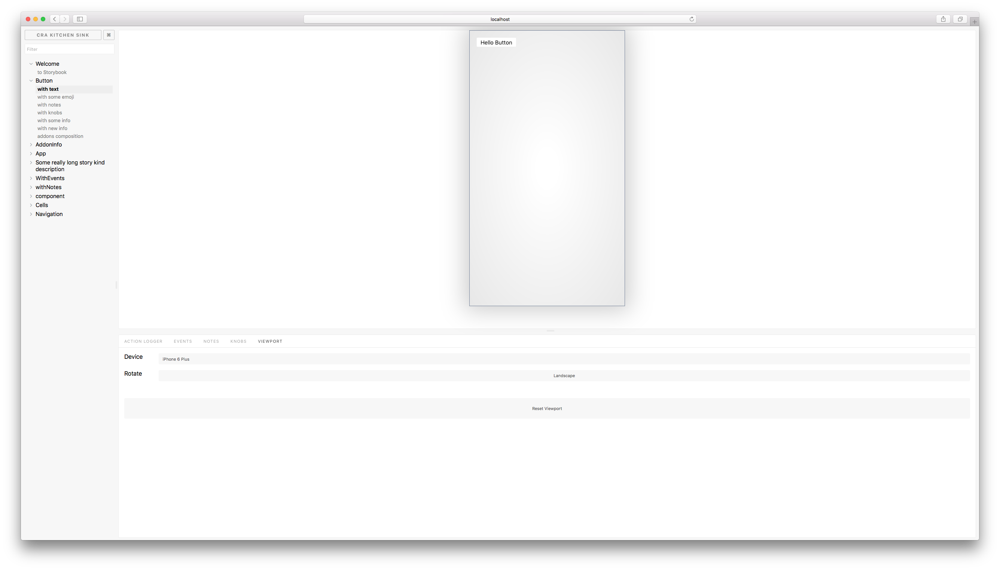

# Storybook Viewport Addon

Storybook Viewport Addon allows your stories to be displayed in different sizes and layouts in [Storybook](https://storybookjs.org).  This helps build responsive components inside of Storybook.

This addon works with Storybook for: [React](https://github.com/storybooks/storybook/tree/master/app/react) and [Vue](https://github.com/storybooks/storybook/tree/master/app/vue).



## Installation

Install the following npm module:

    npm i -D @storybook/addon-viewport

or with yarn:

    yarn add -D @storybook/addon-viewport

## Basic Usage

Simply import the Storybook Viewport Addon in the `addon.js` file in your `.storybook` directory.

```js
import '@storybook/addon-viewport/register'
```

This will register the Viewport Addon to Storybook and will show up in the action area.

## FAQ

#### Adding more devices

Unfortunately, this is currently not supported.

#### Custom Screen Sizes

Unfortunately, this is currently not supported.
