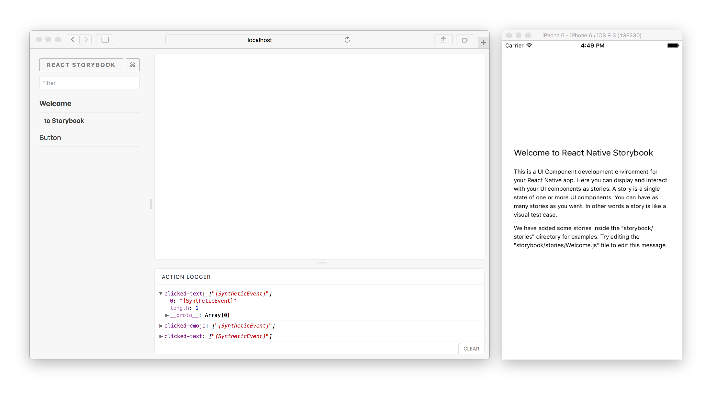

# Storybook for React Native

[](https://circleci.com/gh/storybooks/storybook)
[](https://www.codefactor.io/repository/github/storybooks/storybook)
[](https://snyk.io/test/github/storybooks/storybook/8f36abfd6697e58cd76df3526b52e4b9dc894847)
[](https://bettercodehub.com/results/storybooks/storybook) [](https://codecov.io/gh/storybooks/storybook)  
[](https://now-examples-slackin-nqnzoygycp.now.sh/)
[](#backers) [](#sponsors)

* * *

With Storybook for React Native you can design and develop individual React Native components without running your app.



For more information visit: [storybook.js.org](https://storybook.js.org)

## Getting Started

The `getstorybook` tool can be used to add Storybook to your React Native app. Install the `getstorybook` tool if necessary and run it from your project directory with these commands:

```shell
npm -g i @storybook/cli
getstorybook
```

After you have installed, there are additional steps for `create-react-native-app` apps. See the section for details, otherwise skip to [Start Storybook](#start-storybook)
to see the next step.

## Create React Native App (CRNA)

If you run `getstorybook` inside a CRNA app, you'll be notified that there is an extra step required to use Storybook.

The easiest way to use Storybook inside CRNA is to simply replace your App with the Storybook UI, which is possible by replacing `App.js` with a single line of code:

```js
export default from './storybook';
```

This will get you up and running quickly, but then you lose your app!
There are multiple options here. for example, you can export conditionally:

```js
import StorybookUI from './storybook';

import App from './app';

module.exports = __DEV__ ? StorybookUI : App;
```

Alternatively, `StorybookUI` is simply a RN `View` component that can be embedded anywhere in your RN application, e.g. on a tab or within an admin screen.

## Start Storybook

After initial setup start the storybook server with the storybook npm script.

```shell
npm run storybook
```

Now, you can open <http://localhost:7007> to view your storybook menus in the browser.

## Start App

To see your Storybook stories on the device, you should start your mobile app for the `<platform>` of your choice (typically `ios` or `android`). (Note that due to an implementation detail, your stories will only show up in the left pane of your browser window after your device has connected to this storybook server.)

For CRNA apps:

    npm run <platform>

For RN apps:

    react-native run-<platform>

Once your app is started, changing the selected story in web browser will update the story displayed within your mobile app.

If you are using Android and you get the following error after running the app: `'websocket: connection error', 'Failed to connect to localhost/127.0.0.1:7007'`, you have to forward the port 7007 on your device/emulator to port 7007 on your local machine with the following command:
`adb reverse tcp:7007 tcp:7007`

## Using Haul-cli

[Haul](https://github.com/callstack-io/haul) is an alternative to the react-native packager and has several advantages in that it allows you to define your own loaders, and handles symlinks better.

If you want to use haul instead of the react-native packager, modify the storybook npm script to:

```sh
storybook start -p 7007 --haul webpack.haul.storybook.js --platform android | ios | all
```

Where webpack.haul.storybook.js should look something like this:

```js
module.exports = ({ platform }) => ({
  entry: `./storybook/index.${platform}.js`,
  // any other haul config here.
});
```

## Learn More

Check the `docs` directory in this repo for more advanced setup guides and other info.
