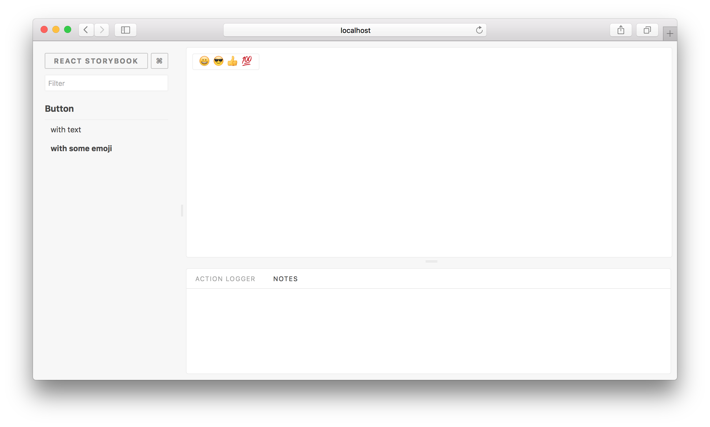

Storybook comes with a variety of "core" addons developed and maintained alongside Storybook. Most examples in this site use [actions](https://github.com/storybooks/storybook/tree/master/addons/actions) and [links](https://github.com/storybooks/storybook/tree/master/addons/links). But it's easy to use any third party addons distributed via NPM.

Here's how to do it.

We are going to use an addon called [Notes](https://github.com/storybooks/storybook/tree/master/addons/notes). Basically, it allows you to write notes for your stories.

First, we need to install the addons:

```sh
npm i --save-dev @storybook/addon-actions @storybook/addon-links @storybook/addon-notes
```

Then, we need to create a file called `addons.js` inside the storybook config directory and add the following content:

```js
import '@storybook/addon-actions/register';
import '@storybook/addon-links/register';
import '@storybook/addon-notes/register';
```

This will register all the addons and you'll be able to see the actions and notes panels (in that order) when you are viewing the story. (Links do not register a tab--check individual addon docs to see which Storybook features they use!)



Now when you are writing a story it like this and add some notes:

```js
import { storiesOf } from '@storybook/react';
import { action } from '@storybook/addon-actions';
import { WithNotes } from '@storybook/addon-notes';

import Button from './Button';

storiesOf('Button', module)
  .add('with some emoji', () => (
    <WithNotes notes={'Here we use some emoji as the Button text. Doesn&apos;t it look nice?'}>
      <Button onClick={action('clicked')}>😀 😎 👍 💯</Button>
    </WithNotes>
  ));
```

Then you'll be able to see those notes when you are viewing the story.


Just like this, you can install any other addon and use it. Have a look at our [addon gallery](/addons/addon-gallery) to discover more addons.
