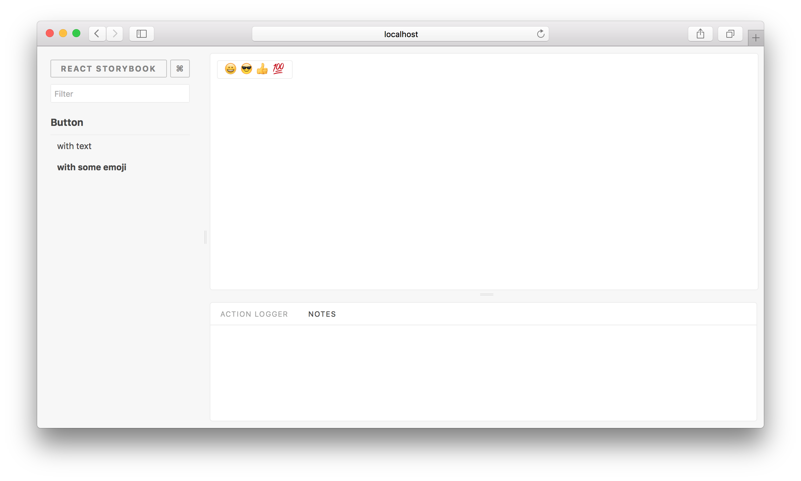

Storybook comes with a variety of "core" addons developed and maintained alongside Storybook. Most examples in this site use [actions](https://github.com/storybooks/storybook/tree/master/addons/actions) and [links](https://github.com/storybooks/storybook/tree/master/addons/links). But it's easy to use any third party addons distributed via NPM.

Here's how to do it.

We are going to use an addon called [Notes](https://github.com/storybooks/storybook/tree/master/addons/notes). Basically, it allows you to write notes for your stories.

First, we need to install the addons:

```sh
yarn add -D @storybook/addons @storybook/addon-actions @storybook/addon-knobs @storybook/addon-notes
```

Then, we need to create a file called `addons.js` inside the storybook config directory and add the following content:

```js
import '@storybook/addon-actions/register';
import '@storybook/addon-knobs/register';
import '@storybook/addon-notes/register';
```

Once created, you'll have to restart storybook to make the underlying webpack aware of the addons file.

This will register all the addons and you'll be able to see the actions and knobs panels (in that order) when you are viewing the story. (Links do not register a tab--check individual addon docs to see which Storybook features they use!)



## Addons tab order

The tab order is created by the import order in the `addons.js` file. In the example, the actions addon is the first and thus active tab. Resorting the imports results in the knobs addon tab being placed before the actions tab:

```js
import '@storybook/addon-actions/register';
import '@storybook/addon-knobs/register';
```

## Using the addon

Now when you are writing a story, you can import the actions addon to log actions. Also, you can add notes:

```js
import { storiesOf } from '@storybook/react';
import { action } from '@storybook/addon-actions';

import Button from './Button';

storiesOf('Button', module).add(
  'with some emoji',
  () => (
    () => (
      <Button onClick={action('clicked')}>
        <span role="img" aria-label="so cool">
          😀 😎 👍 💯
        </span>
      </Button>
    ),
    { notes: 'A very simple component' }
  )
);
```

Then you'll be able to see those notes when you are viewing the story.


## Global Configuration

Sometimes you might want to configure an addon globally, as in the case of collocating stories with components, or just simply to keep your stories file cleaner. To do that, you can add your decorators to a config file, typically in `.storybook/config.js`. Here's an example of how you might do that.

```js
import { configure, addParameters } from '@storybook/react';

addParameters({
  options: {
    name: 'CRA Kitchen Sink',
    isFullscreen: false,
    showPanel: true,
    // more configuration here
  },
});
```

Here's an example of a [production-ready config file](https://github.com/storybooks/storybook/blob/next/examples/cra-kitchen-sink/.storybook/config.js) from the cra-kitchen example.

Just like this, you can install any other addon and use it. Have a look at our [addon gallery](https://storybook.js.org/addons/) to discover more addons.
