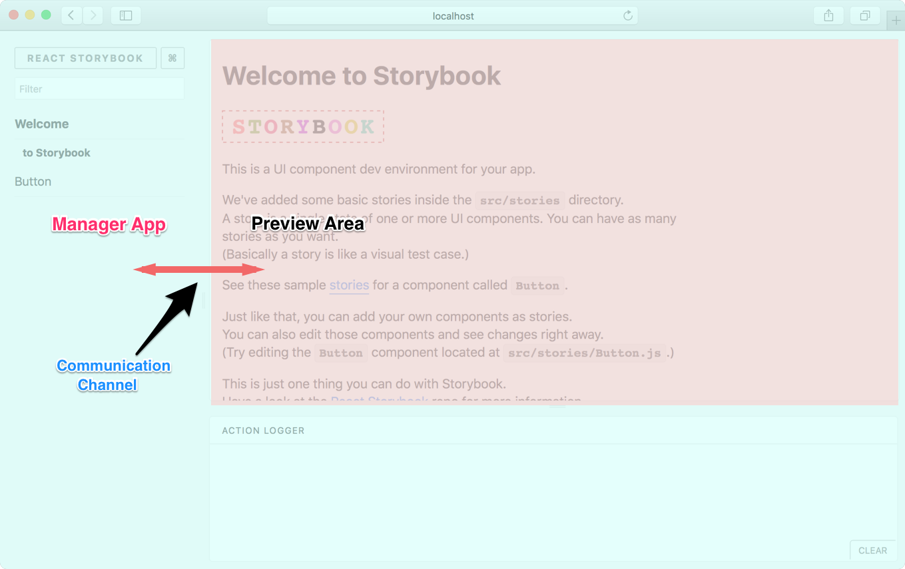
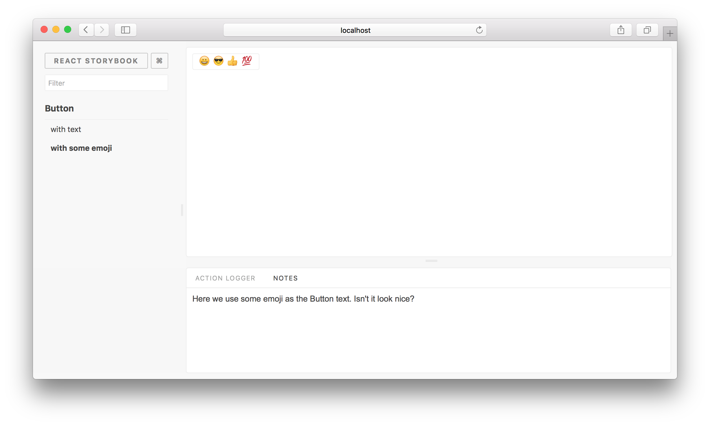

This is a complete guide on how to create addons for Storybook.

## Storybook Basics

Before we begin, we need to learn a bit about how Storybook works. Basically, Storybook has a **Manager App** and a **Preview Area**.

Manager App is the client side UI for Storybook. Preview Area is the place where the story is rendered. Usually the Preview Area is an iframe.

When you select a story from the Manager App, the relevant story is rendered inside the Preview Area.



As shown in the above image, there's a communication channel that the Manager App and Preview Area use to communicate with each other.

## Capabilities

With an addon, you can add more functionality to Storybook. Here are a few things you could do:

-   Add a panel to Storybook (like Action Logger).
-   Interact with the story and the panel.
-   Set and get URL query params.
-   Select a story.
-   Register keyboard shortcuts (coming soon).

With this, you can write some pretty cool addons. Look at our [Addon gallery](/addons/addon-gallery) to have a look at some sample addons.

## Getting Started

Let's write a simple addon for Storybook. It's a Notes addon on which you can display some notes for a story.

> Just for the simplicity, we'll write the addon right inside our app. But we can easily move it into a separate NPM module.

## How it looks

We write a story for our addon like this:

```js
import React from 'react';
import { storiesOf } from '@storybook/react';
import { action } from '@storybook/addon-actions';
import { WithNotes } from '../notes-addon';

import Button from './Button';

storiesOf('Button', module)
  .add('with text', () => (
    <WithNotes notes={'This is a very simple Button and you can click on it.'}>
      <Button onClick={action('clicked')}>Hello Button</Button>
    </WithNotes>
  ))
  .add('with some emoji', () => (
    <WithNotes notes={'Here we use some emoji as the Button text. Doesn&apos;t it look nice?'}>
      <Button onClick={action('clicked')}>😀 😎 👍 💯</Button>
    </WithNotes>
  ));
```

Then it will appear in the Notes panel like this:



## Setup

First, create an `addons.js` inside the Storybook config directory and add the following content to it.

```js
// Register the actions addon that we used above
import '@storybook/addon-actions/register';
```

We'll use this file shortly to register the Notes addon we are building.

Now we need to create two files, `register.js` and `index.js,` inside a directory called `src/notes-addon`.

## The Addon

Let's add the following content to the `index.js`. It will expose a class called `WithNotes`, which wraps our story.

```js
import React from 'react';
import addons from '@storybook/addons';

export class WithNotes extends React.Component {
  render() {
    const { children, notes } = this.props;
    const channel = addons.getChannel();

    // send the notes to the channel.
    channel.emit('kadira/notes/add_notes', notes);
    // return children elements.
    return children;
  }
}
```

In this case, our component can access something called the channel. It lets us communicate with the panel (where we display notes). It has a NodeJS [EventEmitter](https://nodejs.org/api/events.html) compatible API.

In the above case, it will emit the notes text to the channel, so our panel can listen to it.

Then add the following code to the register.js.

See: <https://gist.github.com/arunoda/fb3859840ff616cc5ea0fa3ef8e3f358>

It will register our addon and add a panel. In this case, the panel represents a React component called `Notes`. That component has access to the channel and storybook api.

Then it will listen to the channel and render the notes text on the panel. Have a look at the above annotated code.

> In this example, we are only sending messages from the Preview Area to the Manager App (our panel). But we can do it the other way around as well.

It also listens to another event, called onStory, in the storybook API, which fires when the user selects a story. We use that event to clear the previous notes when selecting a story.

### Register the addon

Now, finally, we need to register the addon by importing it to the `.storybook/addons.js` file.

```js
// Register the actions addon that we used above
import '@storybook/addon-actions/register';

// Our addon
import '../src/notes-addon/register';
```

> Above code runs in the Manager App but not in the preview area.

That's it. Now you can create notes for any story as shown below:

```js
import React from 'react';
import { storiesOf } from '@storybook/react';
import { action } from '@storybook/addon-actions';
import { WithNotes } from '../notes-addon';

import Button from './Button';

storiesOf('Button', module)
  .add('with text', () => (
    <WithNotes notes={'This is a very simple Button and you can click on it.'}>
      <Button onClick={action('clicked')}>Hello Button</Button>
    </WithNotes>
  ))
  .add('with some emojies', () => (
    <WithNotes notes={'Here we use emojies as the Button text. Doesn&apos;t it look nice?'}>
      <Button onClick={action('clicked')}>😀 😎 👍 💯</Button>
    </WithNotes>
  ));
```

## Addon API

Here we've only used a few functionalities of our [Addon API](/addons/api).
You can learn more about the complete API [here](/addons/api).

## Packaging

You can package this addon into a NPM module very easily. Have a look at this [package](https://github.com/storybooks/storybook/tree/master/addons/notes).

In addition to moving the above code to an NPM module, we've set `react` and `@storybook/addons` as peer dependencies.

### Local Development

When you are developing your addon as a package, you can't use `npm link` to add it your project. Instead add your package as a local dependency into your `package.json` as shown below:

```json
{
  "dependencies": {
    "@storybook/addon-notes": "file:///home/username/myrepo"
  }
}
```

### Package Maintenance

Your packaged Storybook addon needed to be written in ES5. If you are using ES6, then you need to transpile it.
In that case, we recommend to use [React CDK](https://github.com/kadirahq/react-cdk) for that.
