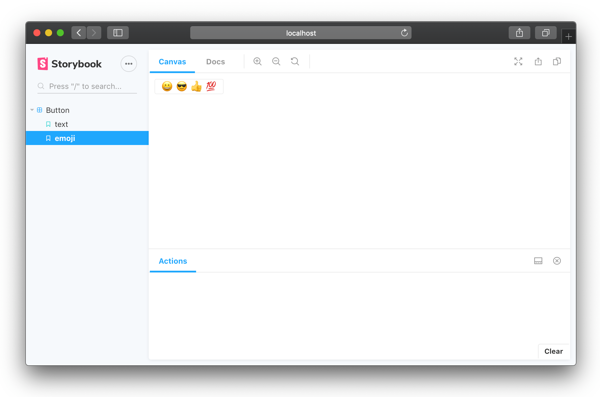

You may have tried to use our quick start guide to setup your project for Storybook. If you want to set up Storybook manually, this is the guide for you.

> This will also help you to understand how Storybook works.

## Starter Guide React

Storybook has its own Webpack setup and a dev server. Webpack setup is very similar to [Create React App](https://github.com/facebookincubator/create-react-app), but allows you to configure as you want.

In this guide, we are trying to set up Storybook for your React project.

## Table of contents

-   [Add @storybook/react](#add-storybookreact)
-   [Add react and react-dom](#add-react-and-react-dom)
-   [Create the config file](#create-the-config-file)
-   [Write your stories](#write-your-stories)
-   [Run your Storybook](#run-your-storybook)

## Add @storybook/react

First of all, you need to add `@storybook/react` to your project. To do that, simply run:

```sh
npm i --save-dev @storybook/react
```

## Add react and react-dom

Make sure that you have `react` and `react-dom` in your dependencies as well because we list these as a peerDependency:

```sh
npm i --save react react-dom
```

Then add the following NPM script to your package json in order to start the storybook later in this guide:

```json
{
  "scripts": {
    "storybook": "start-storybook -p 9001 -c .storybook"
  }
}
```

## Create the config file

Storybook can be configured in several different ways. 
That’s why we need a config directory. We've added a `-c` option to the above NPM script mentioning `.storybook` as the config directory.

For the basic Storybook configuration file, you don't need to do much, but simply tell Storybook where to find stories.

To do that, simply create a file at `.storybook/config.js` with the following content:

```js
import { configure } from '@storybook/react';

function loadStories() {
  require('../stories/index.js');
  // You can require as many stories as you need.
}

configure(loadStories, module);
```

That'll load stories in `../stories/index.js`.

Just like that, you can load stories from wherever you want to.

## Write your stories

Now you can write some stories inside the `../stories/index.js` file, like this:

```js
import React from 'react';
import { storiesOf } from '@storybook/react';
import { action } from '@storybook/addon-actions';
import Button from '../components/Button';

storiesOf('Button', module)
  .add('with text', () => (
    <Button onClick={action('clicked')}>Hello Button</Button>
  ))
  .add('with some emoji', () => (
    <Button onClick={action('clicked')}>😀 😎 👍 💯</Button>
  ));   
```

Story is a single state of your component. In the above case, there are two stories for the native button component:

1.  with text
2.  with some emoji

## Run your Storybook

Now everything is ready. Simply run your storybook with:

```sh
npm run storybook
```

Then you can see all your stories, like this:



Now you can change components and write stories whenever you need to. You'll get those changes into Storybook in a snap with the help of Webpack's HMR API.
