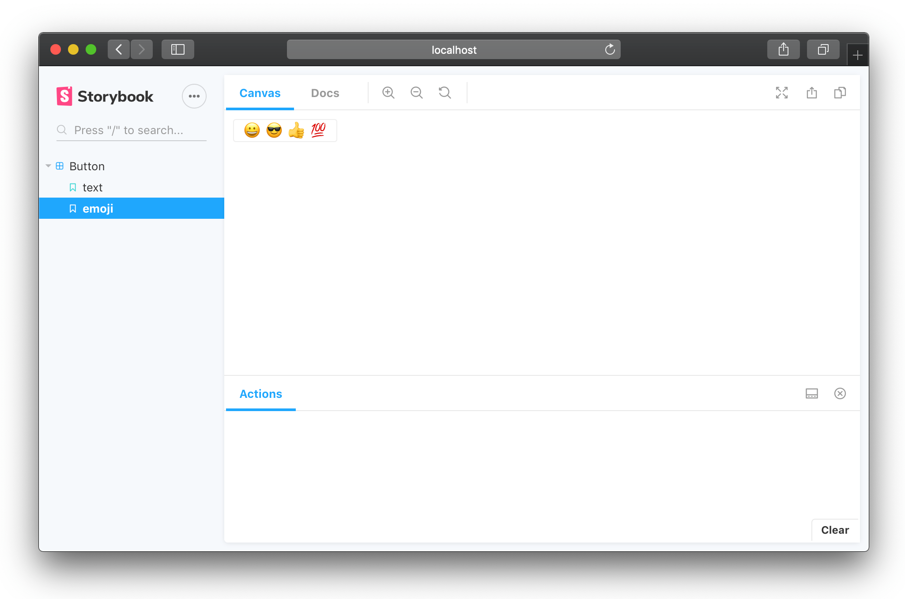

Storybook is a UI development environment for your UI components.
With it, you can visualize different states of your UI components and develop them interactively.

Storybook runs outside of your app.
So you can develop UI components in isolation without worrying about app specific dependencies and requirements.

Storybook also comes with a lot of [addons](/addons/introduction) and a great API to customize as you wish.
You can also build a [static version](/basics/exporting-storybook) of your storybook and deploy it anywhere you want.

Here are some featured storybooks that you can reference to see how Storybook works:

-   [React Button](http://kadira-samples.github.io/react-button) - [source](https://github.com/kadira-samples/react-button)
-   [Demo of React Dates](http://airbnb.io/react-dates/) - [source](https://github.com/airbnb/react-dates)
-   [Demo of React Native Web](http://necolas.github.io/react-native-web/storybook/) - [source](https://github.com/necolas/react-native-web)
