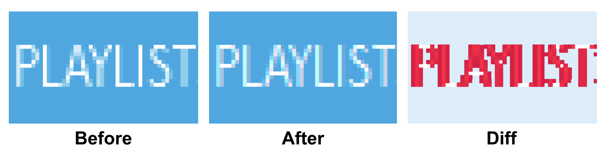

Automated Visual Testing is a quality assurance process meant to automatically verify that a UI visually appears as intended. There are many alternative names for this process, such as Visual Regression Testing, Visual Validation Testing, Visual UI Testing, or just simply Visual Testing, but in all cases we're talking about confirming the thing your users will see—the actual pixels—without caring about how it's generated.

## Benefits

The largest benefit to Automated Visual Testing is that they can often supersede other, more brittle tests. Instead of asserting specific CSS rules, selectors, and HTML markup, you assert that something visually appears as expected. If you refactor style, markup, or state logic, but visually nothing changes, you wouldn't need to modify any tests or update visual baselines! In a majority of cases, what a user _sees_ is what you really care about, not how it was achieved.

Another potential benefit is with cross-browser testing. If you perform your visual tests against multiple browsers, they can potentially catch regressions a developer didn't because it appeared correct in their preferred development browser.

## Challenges

The biggest challenge with Automated Visual Testing is that humans and machines perceive pixels differently. Two screenshots of a UI could appear entirely identical to a human but 100% different to a simple 1:1, naive diffing algorithm.

For example, changes in [anti-aliasing](https://en.wikipedia.org/wiki/Spatial_anti-aliasing) are common, even if human eyes don't notice them.




Even though we didn't change any CSS and the menus appear visually the same to our eyes, if we just compare their pixels 1:1 we find that lots of it has changed! This can happen between browser versions, underlying hardware changes on your cloud platform, and more.

Similar situations happen all the time, such as how images, drop shadows, etc are rendered.

Some more robust libraries and services solve this by using a combination of [Machine Learning](https://wikipedia.org/wiki/Machine_learning) and [heuristics](https://wikipedia.org/wiki/Heuristic_(computer_science)). The machine is trained what is and is not an acceptable variation.

For example, every graphics card renders text and images differently at the pixel level. Your machine will likely have a different graphics card than the testing server and the other developers. While the naked eye can't tell the difference, a machine needs to be trained to "see" them like we do.

Another issue is that these tests are often slow compared to more lightweight unit tests that don't require a full browser. So you might only run them when you commit, push, and/or on your Continuous Integration (CI) server.

## Libraries and Services with Storybook Integration

There are many libraries and services that have Storybook integrations out-of-box, with varying levels of sophistication. Some even use complex Machine Learning instead of 1:1 pixel comparison.

Here are some in alphabetical order:

- [Applitools](https://applitools.com/storybook)
- [Chromatic](https://www.chromaticqa.com)
- [Loki](https://loki.js.org/)
- [Percy](https://docs.percy.io/docs/storybook-for-react)
- [Screener](https://screener.io/v2/docs)
- [StoryShots](https://github.com/storybooks/storybook/tree/master/addons/storyshots) with its [seamless integration](https://github.com/storybooks/storybook/tree/master/addons/storyshots#configure-storyshots-for-image-snapshots) with [jest-image-snapshot](https://github.com/americanexpress/jest-image-snapshot)

## Custom Solutions

There are a number of popular libraries that don't offer out-of-box integration with Storybook, but still can be used to visual test it. [BackstopJS](https://github.com/garris/BackstopJS) and [Gemini](https://github.com/gemini-testing/gemini), for example, but there are quite a few!

Storybook's web server supports the ability to render a component story standalone, in any particular state, without any of the Storybook layout elements. With these special URLs you can either create your own screenshots and diff them, or use a library which does that work for you.

Let's take a look at an example, in this case using [jest-image-snapshot](https://github.com/americanexpress/jest-image-snapshot)—but the idea is similar for most of them.

> Most custom solutions, including jest-image-snapshot, do 1:1 pixel comparisons which may suffer from issues described in the **Challenges** section above.

### Example using Puppeteer and Jest

Here's a sample Storybook we'd like to visually test:


The Storybook UI has a bunch of elements you wouldn't want to include in your visual test. Besides being extraneous, your tests could incorrectly fail when you add a new, unrelated story or state because it would show up in the side menu.

Instead, we'll want to render a component's story by itself. Let's assume the above Storybook runs on port 9009 and we can access it via [http://localhost:9009/](http://localhost:9009/).

Now let's pick a single story: the "with text" story of the Button.

The URL for that story contains a number of query parameters, but the first two are the most important: [http://localhost:9009/?selectedKind=Button&selectedStory=with+text](http://localhost:9009/?selectedKind=Button&selectedStory=with+text)

- selectedKind=Button
- selectedStory=with+text

Using these two parameters we can generate the URL to render the story by itself. Instead of the URL's path being the homepage/index we use `/iframe.html`:

[http://localhost:9009/iframe.html?selectedKind=Button&selectedStory=with+text](http://localhost:9009/iframe.html?selectedKind=Button&selectedStory=with+text)


Now that we know how to render the story by itself, let's get our testing environment all set up.

For this example, we're going to use a number of packages:

* [jest](https://jestjs.io/)
  - Testing framework by Facebook
* [puppeteer](https://developers.google.com/web/tools/puppeteer/)
  - Library by Google for controlling a [headless](https://wikipedia.org/wiki/Headless_software) Chrome browser.
* [jest-puppeteer](https://github.com/smooth-code/jest-puppeteer)
  - Integration between Jest and Puppeteer
* [jest-image-snapshot](https://github.com/americanexpress/jest-image-snapshot)
  - Image snapshot assertion helper
* [start-server-and-test](https://github.com/bahmutov/start-server-and-test)
  - Used to start/stop our Storybook server automatically for our tests

> Even though we're choosing Jest/Puppeteer in this example, the principles are the same with other solutions.

Let's go ahead and add all of these:

```sh
yarn add jest puppeteer jest-puppeteer jest-image-snapshot start-server-and-test --dev
```

There's a bit of setup code that needs to run before your tests, so we'll need to configure a Jest setup file to run first, if you haven't already. This is done with the [`setupTestFrameworkScriptFile` config property](https://jestjs.io/docs/en/configuration.html#setuptestframeworkscriptfile-string), either in your package.json or in your `jest.config.js`. We'll also set `"preset": "jest-puppeteer"` so that we get the nice integration from jest-puppeteer.

#### `integration/jest.config.js`

```js
module.exports = {
  preset: 'jest-puppeteer',
  testRegex: './*\\.test\\.js$',
  setupTestFrameworkScriptFile: './setupTests.js'
};

 ```

With our configuration in place, we can create our file at `integration/setupTests.js` and add the necessary setup logic:

#### `integration/setupTests.js`

```js
const { toMatchImageSnapshot } = require('jest-image-snapshot');

expect.extend({ toMatchImageSnapshot });
```

Finally, we'll create some npm scripts for us to kick everything off with [start-server-and-test](https://github.com/bahmutov/start-server-and-test):

#### `package.json`

```json
{
  "name": "my-app",
  "scripts": {
    "jest:integration": "jest -c integration/jest.config.js",
    "test:integration": "start-server-and-test storybook http-get://localhost:9009 jest:integration",
    "storybook": "start-storybook -p 9009 -s public"
  }
}
```

Now we're ready to write our first visual snapshot test!

#### `integration/Button.test.js`

```js
describe('Button', () => {
  it('visually looks correct', async () => {
    // APIs from jest-puppeteer
    await page.goto('http://localhost:9009/iframe.html?selectedKind=Button&selectedStory=with+text');
    const image = await page.screenshot();

    // API from jest-image-snapshot
    expect(image).toMatchImageSnapshot();
  });
});
```

Go ahead and run it:

```bash
npm run test:integration
```

```
info Storybook started on => http://localhost:9009/

 PASS  integration/app.test.js
  Button
    ✓ visually looks correct (699ms)

 › 1 snapshot written.
Snapshot Summary
 › 1 snapshot written from 1 test suite.

Test Suites: 1 passed, 1 total
Tests:       1 passed, 1 total
Snapshots:   1 written, 1 total
Time:        1.528s, estimated 2s
Ran all test suites.
```

The first time we run a test it will create a new image snapshot to use as the baseline for subsequent test runs. Try changing the style of your story's component and running it again. You should get something like this:

```
 FAIL  integration/app.test.js
  Button
    ✕ visually looks correct (880ms)

  ● Button › visually looks correct

    Expected image to match or be a close match to snapshot but was 0.03625% different from snapshot (174 differing pixels).
    See diff for details: /my-app/integration/__image_snapshots__/__diff_output__/app-test-js-button-visually-looks-correct-1-diff.png
```

If this should become the new baseline, we can tell Jest to update them:

```
npm run jest:integration -- -updateSnapshot
```

We're all set, but keep in mind the [challenges](#challenges) of doing 1:1 pixel matching!
