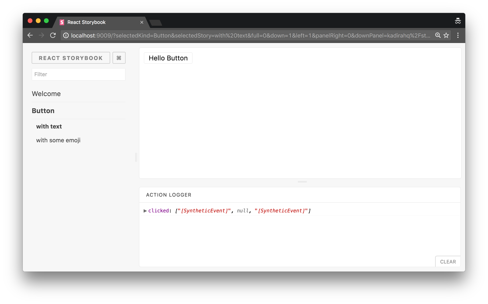
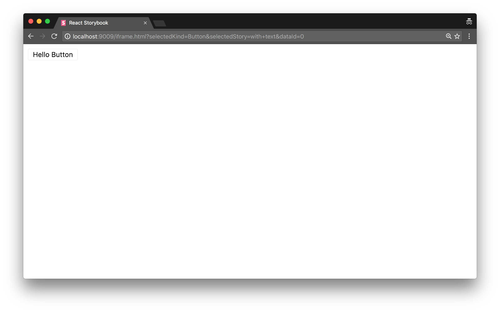

We can also use Storybook as the base for CSS/Style testing with stories as the base. For information on how to correctly apply all of your styles as well as styles from CSS frameworks like Boostrap, Semantic UI or similar check the [configurations section](https://storybook.js.org/configurations/default-config/#css-support). Back to CSS/Style testing: let's have a look at the following Storybook.

In that, you can see the Storybook's manager UI. It has UI elements that are not related to your app. However, there's a way to access just a single story.

For an example, let's assume the above storybook runs on port 9009 and we can access it via [http://localhost:9009](http://localhost:9009/).
Then Let's pick a single story: the "with text" story of the Button. So, in this case:

-   selectedKind = Button
-   selectedStory = with text

Then, we can see the above story using the following URL:

<http://localhost:9009/iframe.html?selectedKind=Button&selectedStory=with+text&dataId=0>

Just like that, you can access all of the stories in your Storybook.

## Supported CSS/Style Testing Frameworks

It will be hard to use all the frameworks we've [mentioned](/testing/react-ui-testing#3-css-style-testing), but we'll be able to use frameworks which are based on URL as the input source. (Such as [BackstopJS](https://github.com/garris/BackstopJS) and [Gemini](https://github.com/gemini-testing/gemini))

> In the future we are also planning to smooth this process with the help of [StoryShots](https://github.com/storybooks/storybook/tree/master/addons/storyshots).
