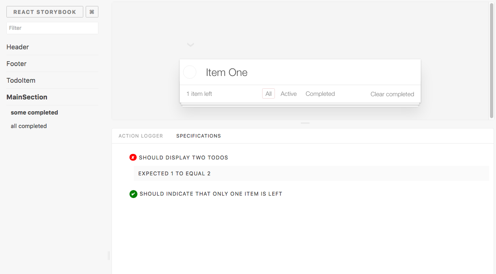

For the interaction testing, [Enzyme](https://github.com/airbnb/enzyme) is the best tool we can use. With that, we can [simulate](http://airbnb.io/enzyme/docs/api/ReactWrapper/simulate.html) user inputs and see what they are doing.

You can directly write these kind of tests with a full-featured testing framework, such as **Mocha** or **Jest**. Have a look at the [Enzyme guidelines](https://github.com/airbnb/enzyme/) for more information on how to integrate them.

## Specs Addon

If you like to write your tests directly inside your stories, we also have an addon called [specs](https://github.com/mthuret/storybook-addon-specifications).

With that, you can write test specs directly inside stories.
Additionally, you also can use your CI server to run those tests.
