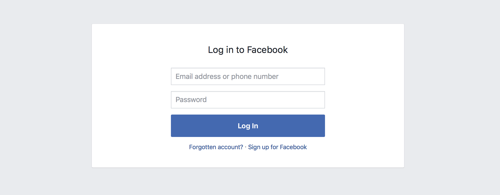

There are different aspects we need to look at when testing UI.
There are also a lot of tools and techniques we can use. 

## Reasons for Testing

Before we talk about testing, we need to think about why we need to test.
There are many reasons; here are some of our reasons:

-   To find bugs.
-   To make sure things won't break between new code commits.
-   To keep tests as living documentations.

Specifically, testing is important when working with teams since it allows different people the ability to contribute with confidence.

## Different Aspects of UI Testing

We refer UI for many things. To put this in focus, let's narrow it down to React based user interfaces.

### 1. Structural Testing

Here we'll focus on the structure of the UI and how it's laid out.
For an example, let's say we have a "login component" as shown below:

For structural testing, we are testing whether or not it has following content:

-   A title with "Login in to Facebook"
-   Two inputs for the username and password.
-   A submit button.
-   An error screen to show errors.

For React, we have been using [Enzyme](https://github.com/airbnb/enzyme) as a way to do structural testing, but now we can also use [Jest's snapshot testing](https://facebook.github.io/jest/blog/2016/07/27/jest-14.html) to make things even more simple.

### 2. Interaction Testing

UI is all about interacting with the user.
We do this with a bunch of UI elements, such as buttons, links, and input elements.
With interaction testing, we need to test if they are working properly.

Let's again use the above login component as an example. It should do these things:

-   When we click the submit button, it should give us the username and password.
-   When we click the "Forgotten Account" link, it should redirect to a new page.

We have few ways to do this type of testing with React. The simple way is to use [Enzyme](https://github.com/airbnb/enzyme).

### 3. CSS/Style Testing

UI is all about styles (whether they're simple, beautiful, or even ugly).
With style testing, we are evaluating the look and feel of our UI components between code changes.
This is a pretty complex subject and usually we do it by comparing images.

If we are using inline styles all the way, we can use JEST snapshot testing.
But to get even better results, we should consider using tools such as:

-   [BackstopJS](https://github.com/garris/BackstopJS)
-   [PhantomCSS](https://github.com/Huddle/PhantomCSS)
-   [Gemini](https://github.com/gemini-testing/gemini)
-   [Happo](https://github.com/Galooshi/happo)

### 4. Manual Testing

All the above sections are about testing with automated tools.
But since we are building UI for humans, we must also manually test them to see how they feel.

Another reason for manual testing is for the better user experience.

We should always try to test our UI with the naked eye.
For this, we can simply use our existing Storybook.
This is something that we can't automate(yet) and takes time.
But it would be great if we could do this once in a while (especially with a major code changes).

## How Storybook Can Help Us

A **story** is a smallest unit in Storybook.
It's a fully functioning UI element where the input can be used for any of the testing methods we've mentioned above.

Let's look at how Storybook can help you do the above mentioned different aspects of testing.

-   [Structural Testing with StoryShots](/testing/structural-testing)
-   [Interaction Testing with Specs Addon](/testing/interaction-testing)
-   [Storybook as the Base for CSS/Style Testing](/testing/css-style-testing)
-   [Storybook for Manual UI Testing](/testing/manual-testing)
