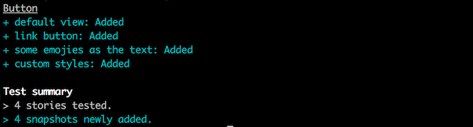
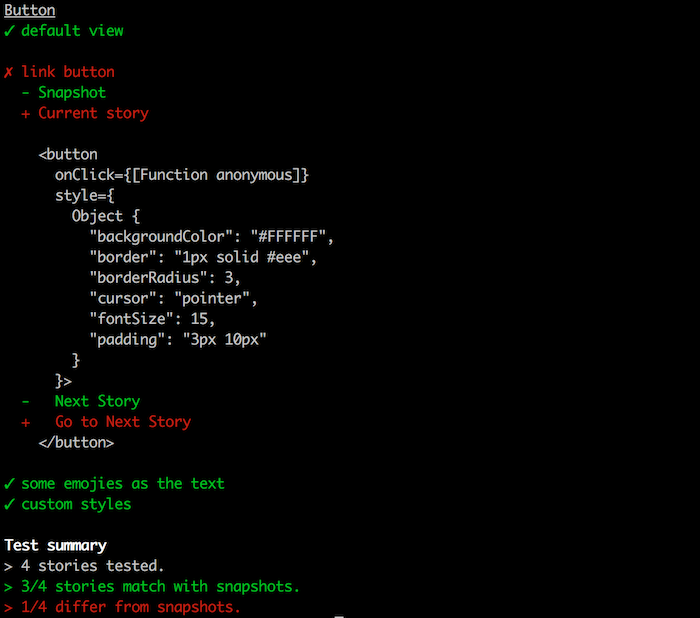

For React, [Jest's snapshot testing](https://facebook.github.io/jest/blog/2016/07/27/jest-14.html) is the best way to do Structural Testing.
It's painless to use and maintain.
We've integrated Jest's snapshot testing directly into Storybook using an addon called [StoryShots](https://github.com/storybooks/storybook/tree/master/addons/storyshots).
Now we can simply use existing stories as the input for snapshot testing.

## What's Snapshot Testing?

With Snapshot testing, we keep a file copy of the structure of UI components.
Think of it like a set of HTML sources.

Then, after we've completed any UI changes, we compare new snapshots with the snapshots that we kept in the file.

If things are not the same, we can do two things:

1.  We can consider new snapshots that show the current state, and then update them as new snapshots.
2.  We can find the root cause for the change and fix our code.

> We can also commit these snapshots directly into the source code.

## Using StoryShots

[StoryShots](https://github.com/storybooks/storybook/tree/master/addons/storyshots) is our integration between Storybook and Jest Snapshot Testing.
It's pretty simple to use.

First, make sure you are inside a Storybook-enabled repo (make sure it has few stories).
Then, install StoryShots into your app with:

```sh
npm i -D @storybook/addon-storyshots
```

Then, assuming you are using Jest for testing, you can create a test file `storyshots.test.js` that contains the following:

```js
import initStoryshots from '@storybook/addon-storyshots';

initStoryshots({ /* configuration options */ });
```

Now you can snapshot test all of your stories with:

```sh
npm test
```

This will save the initial set of snapshots inside your Storybook config directory.



After you complete any changes, you can run the test again and find all structural changes.



* * *

StoryShots also comes with a variety of customization options. Have a look at the StoryShots [repo](https://github.com/storybooks/storybook/tree/master/addons/storyshots) for more information.
