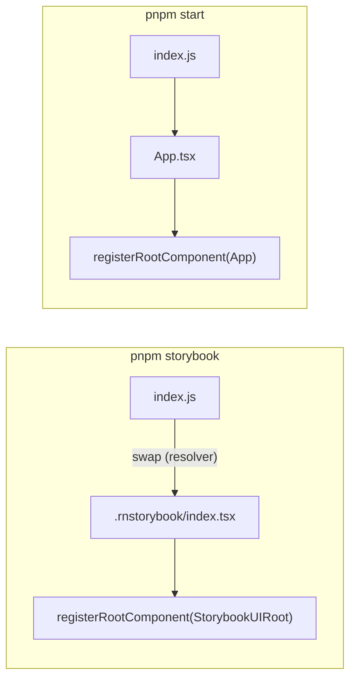

# expo-new-wrapper-example

Minimal Expo app that exercises the new universal `withStorybook` wrapper at
[`@storybook/react-native/withStorybook`](../../packages/react-native/src/withStorybook.ts).

It is intentionally separate from [`expo-example`](../expo-example) so the new
wrapper's behavior can be exercised in isolation, without rozenite, secured
websockets, EAS, or other extras getting in the way.

## How it works

The new wrapper performs an entry-point swap at the Metro resolver level. When
Storybook is enabled, Metro asks for the project entry (`index.js`) and the
resolver redirects it to `.rnstorybook/index.tsx`.

This means `.rnstorybook/index.tsx` becomes the bundle entry, so it is
responsible for calling `registerRootComponent` itself. There is no magic
shim — what you see is what gets executed.

When Storybook is disabled, the wrapper returns the Metro config unchanged.
`index.js` -> `App.tsx` runs as the real (placeholder) app, and Storybook is
not in the bundle because nothing imports it.

## Scripts

- `pnpm storybook` — sets `EXPO_PUBLIC_STORYBOOK_ENABLED=true` and starts Expo.
  Metro swaps the entry to `.rnstorybook/index.tsx` and the on-device Storybook
  UI is shown.
- `pnpm ios` / `pnpm android` — same as `pnpm storybook`, targeted at a
  simulator.
- `pnpm start` — plain `expo start`, no env var. The placeholder `App.tsx`
  renders.
- `pnpm check` — TypeScript check.

## Migration notes

Compared to the old `@storybook/react-native/metro/withStorybook`, two patterns
have changed in this example:

1. `.rnstorybook/index.tsx` is now a bootstrap entry. It must call
   `registerRootComponent` (Expo) or `AppRegistry.registerComponent` (bare RN).
   It does not need to default-export a component anymore.
2. `App.tsx` does not import `.rnstorybook`. Reaching Storybook is the
   wrapper's job, not the app's. As a side benefit, `pnpm start` honestly
   excludes Storybook from the bundle.

## What is not covered here

- Re.Pack — the universal wrapper's `enhanceRepackConfig` branch is not
  exercised. A separate Re.Pack example is the natural follow-up.
- `expo-router` — `resolveEntryPoint`'s `expo-router/entry` detection is also
  unexercised here. Add an `expo-router` variant if you want to cover it.
- The wider feature set demoed in `expo-example` (secured websockets, MCP,
  rozenite, screenshot testing, web). Use `expo-example` for those.
