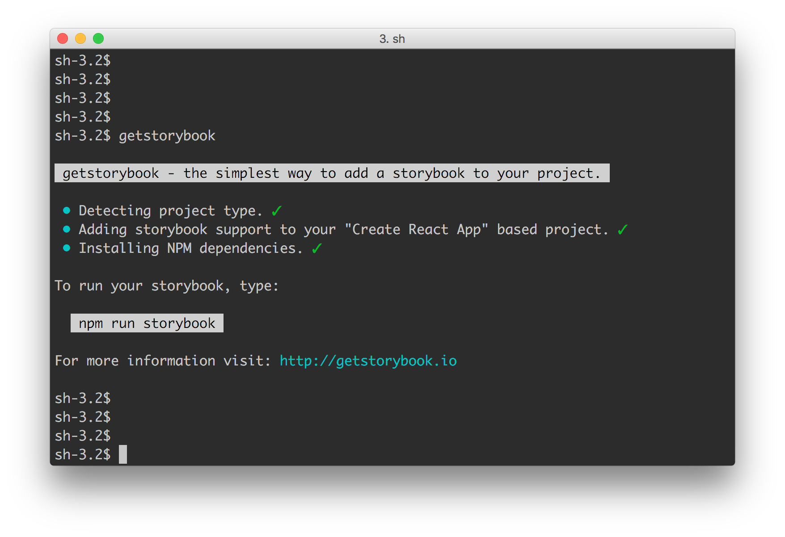

# Storybook CLI

[](https://circleci.com/gh/storybooks/storybook)
[](https://www.codefactor.io/repository/github/storybooks/storybook)
[](https://snyk.io/test/github/storybooks/storybook/8f36abfd6697e58cd76df3526b52e4b9dc894847)
[](https://bettercodehub.com/results/storybooks/storybook) [](https://codecov.io/gh/storybooks/storybook)  
[](https://now-examples-slackin-nqnzoygycp.now.sh/)
[](#backers) [](#sponsors)

* * *

Storybook CLI (*Command Line Interface*) is the easiest way to add [Storybook](https://github.com/storybooks/storybook) to your project.

In the future it will also add other useful generators and migration tooling.



First install the storybook CLI globally.

```sh
npm i -g @storybook/cli
```

Then go to your project run:

```sh
getstorybook
```

That's all you've to do.

* * *

## [Yarn](https://github.com/yarnpkg/yarn) support

It also supports yarn.
If you have installed yarn in your system, it'll detect it and use `yarn` instead of `npm`.

If you don't want to use `yarn` always you can use the `--use-npm` option like this:

```sh
getstorybook --use-npm
```

* * *

## [Flow](https://flow.org/) support

It also supports flow files. By default, [jscodeshift](https://github.com/facebook/jscodeshift), the tool used to transform the source files, uses babel to read the files. To be able to transform any flow annotated file, you need to use the flow parser.

```sh
getstorybook --parser flow
```

For more information visit: [storybook.js.org](https://storybook.js.org)
